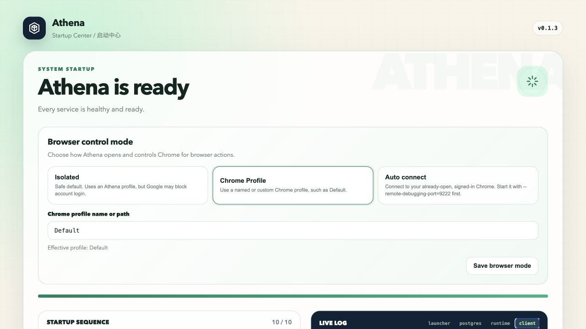
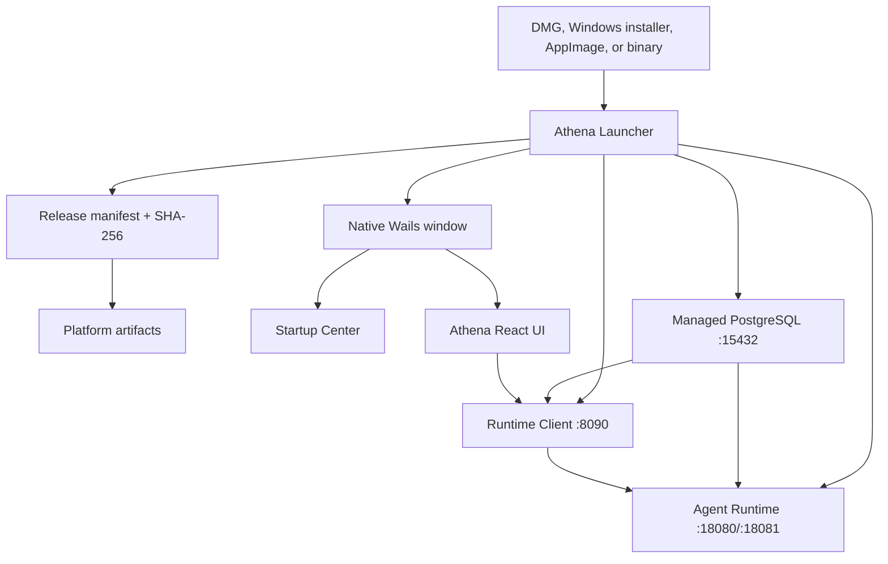

# Athena Launcher

[English](README.md) | [简体中文](README.zh-CN.md)

GA operations: [Athena 1.0 install, upgrade, and recovery](docs/ga-install-upgrade-v1.0.md) | [简体中文](docs/ga-install-upgrade-v1.0.zh-CN.md)

Device runtime design: [Agent Desktop Runtime](docs/agent-desktop-runtime.md)

Browser: [Command Guide](docs/browser-command-guide.md) | [Athena Browser System v3](docs/browser-system-v3.md)

Source code navigation: [Project Structure](docs/project-structure.md)

Athena Launcher is the Wails desktop application and local service manager for the Athena agent platform. A user downloads one package for their operating system; the launcher installs a private PostgreSQL instance, downloads verified Runtime/Client/UI artifacts, generates compatible configuration, starts every service in order, and presents the startup center and Athena UI in a native desktop window.

The desktop shell uses Wails v2 and the operating system WebView. The React UI remains independently versioned and updateable, but is loaded directly by the Wails window instead of a separate frontend HTTP server.

<p align="center">
  
</p>
<p align="center"><sub>The real Startup Center after manifest verification, service health checks, and browser-mode discovery.</sub></p>

## What It Manages

- Detects macOS, Linux, or Windows and `amd64`/`arm64` automatically.
- Downloads PostgreSQL, Agent Browser, Agent Runtime, Agent Runtime Client, and Athena Agent UI for the current platform.
- Verifies every artifact against its SHA-256 value in `release-manifest.json`.
- Initializes PostgreSQL in `~/.athena` with a random password and creates the `agent_runtime` database.
- Generates matching Runtime, Client, and Skills configuration files.
- Starts PostgreSQL, Runtime, Client, and UI in dependency order and checks health endpoints.
- Shows installation, startup, update, live logs, and Athena UI in the native Wails window.
- Desktop mode does not listen on `17890` or `3000`; explicit headless `start`/`run` commands retain the browser interface for compatibility.
- Monitors managed services and restarts unexpected exits.
- Compares local and remote package hashes on launch and asks before updating.
- Reuses verified packages and preserves PostgreSQL/user data across service upgrades.

## Local or Remote Mode

The desktop application asks how to connect before every startup:

- **Local workspace** downloads and manages PostgreSQL, Agent Browser, Runtime, Runtime Client, and the UI.
- **Remote service** downloads or reuses only the Athena UI, checks the remote `agent-runtime-client` `/healthz`, and does not download or start a local database, Browser, Runtime, or Client.

The remote address is stored in `~/.athena/state.json`. Public endpoints must use HTTPS; HTTP is accepted only for localhost and other loopback addresses. Users may enter the service root or paste the full `/api/agent-runtime-client/v1` URL; the Launcher normalizes it. Changing servers clears the previous server's login token, so the user signs in again. The remote service must allow CORS requests from the Athena desktop origin.

## Architecture



Startup sequence:

1. Choose a local workspace or enter a remote Runtime Client address.
2. Load and validate the release manifest for the detected platform.
3. Local mode downloads all missing components; remote mode prepares only the UI. Every download is SHA-256 verified.
4. Local mode generates configuration and starts PostgreSQL, Runtime, and Client; remote mode verifies the remote `/healthz`.
5. Switch the verified UI into the Wails window and enter Athena.

## Install for End Users

Download the latest package from [GitHub Releases](https://github.com/good-fish-man/athena-launcher/releases/latest):

| Platform | Package |
| --- | --- |
| Apple Silicon Mac | `Athena_<version>_macOS_arm64.dmg` |
| Intel Mac | `Athena_<version>_macOS_amd64.dmg` |
| Windows 10/11 x64 | `Athena-Setup_<version>_windows_amd64.exe` |
| Linux x86-64 | `Athena_<version>_linux_x86_64.AppImage` |
| Linux ARM64 | `Athena_<version>_linux_aarch64.AppImage` |

### macOS

Open the DMG, drag **Athena** into Applications, and launch it. Public builds currently use ad-hoc signing unless release secrets are configured. If macOS reports that Apple cannot verify the app, right-click Athena and choose **Open**, or allow it in **System Settings > Privacy & Security**. Production distribution should use Developer ID signing and notarization.

### Windows

Run the installer, then open Athena from the Start menu or desktop shortcut. Production releases should be Authenticode-signed to avoid SmartScreen warnings.

### Linux

Mark the AppImage as executable and run it:

```bash
chmod +x Athena_<version>_linux_x86_64.AppImage
./Athena_<version>_linux_x86_64.AppImage
```

The first local-mode launch can take several minutes while PostgreSQL and service packages are downloaded and initialized; remote mode prepares only the UI.

### First Login

Agent Runtime Client creates the bootstrap administrator only when the `athena`
account is absent from the database. Launcher generates a different random
password for every installation. It is not embedded in any binary, manifest, or
generated YAML. Read it locally from:

```text
~/.athena/secrets/bootstrap-admin.password
```

The secret file is owner-readable only. Restarting Athena does not recreate the
account or reset, activate, or elevate an existing account. Change the generated
password after first login and never publish the contents of the secrets directory.

## Startup Center and Logs

The Wails desktop window opens the startup center immediately. It displays manifest, package, configuration, database, Runtime, Client, and UI steps. On failure, select a log source, copy the error, fix the cause, and choose **Retry startup**.

Default files:

```text
~/.athena/
├── config/                 generated service configuration
├── data/postgres/          persistent PostgreSQL data
├── data/uploads/           uploads and generated reports
├── data/skills/            user skills
├── logs/launcher.log
├── logs/postgres.log
├── logs/agent-runtime.log
├── logs/agent-runtime-client.log
├── packages/               verified downloads
├── services/               versioned service installations
├── state.json
└── startup-status.json
```

Updating a PostgreSQL package does not delete `data/postgres`. Service packages and configuration can be replaced independently from user data.

## Command Line

Desktop packages call the same command-line application internally:

```bash
athena-launcher launch
athena-launcher start
athena-launcher status
athena-launcher stop
athena-launcher update
```

| Command | Purpose |
| --- | --- |
| `launch` | Open the Wails window in installer builds, or the browser UI in CLI builds |
| `start` | Start the managed launcher in the background |
| `run` | Run in the foreground for debugging or a service manager |
| `install` | Download and prepare packages/configuration only |
| `update` | Prepare the latest manifest packages |
| `validate` | Validate a manifest for the current platform |
| `status` | Print component health |
| `stop` | Gracefully stop the managed launcher and services |
| `version` | Print launcher and platform version |

Common options and environment variables:

```bash
athena-launcher run --home /custom/athena --manifest /path/to/release-manifest.json
athena-launcher validate --manifest https://example.com/release-manifest.json

export ATHENA_HOME="$HOME/.athena"
export ATHENA_MANIFEST_URL="https://example.com/release-manifest.json"
```

A production launcher embeds its release manifest URL during compilation. Development builds can use an absolute local path or a localhost HTTP URL. Public remote manifests must use HTTPS.

## Updates and Recovery

At startup, the launcher compares installed hashes with the current manifest. If packages differ, the startup center asks the user before stopping existing processes and installing new versions. Matching packages are reused and are not downloaded twice.

If a port is occupied by a process recorded as Athena's managed process, the launcher stops that process before restart. It does not silently terminate unrelated applications. Use Startup Center logs and `athena-launcher status` to identify conflicts.

To reset only downloaded service packages, stop Athena and remove the relevant version under `~/.athena/services` or `~/.athena/packages`; do not remove `~/.athena/data` unless user data should also be erased.

Launcher also provisions the shared v0.8 Provider Registry under
`~/.athena/plugins`. On first installation it creates a stable local Ed25519
identity, an empty Registry, and shared package/audit directories, then writes
the same paths into Runtime and Runtime Client configuration. Service or package
updates never rotate that identity. Back up the mode-`0600`
`signing/private-key.json`; deleting it prevents signing new local Provider
versions but does not make existing signatures trustworthy under a replacement
key.

## Build from Source

Requirements: Go 1.24 or newer. Desktop builds use Wails v2; Linux builds also require the GTK3 and WebKit2GTK 4.1 development packages.

```bash
git clone https://github.com/good-fish-man/athena-launcher.git
cd athena-launcher
make test
make build
make desktop
make desktop-run
```

The source pins the official release Ed25519 public key, so `go run ./cmd/athena-launcher validate`, `make build`, and `make desktop-run` need no `ATHENA_RELEASE_PUBLIC_KEY` when they use the default official manifest. Launcher does not download a public key at runtime because fetching it beside the manifest would not establish an independent trust root. A local manifest with `development: true` skips release-signature verification while retaining schema, platform, hash, and safe-path validation. `ATHENA_RELEASE_PUBLIC_KEY` is limited to local signed-manifest release-pipeline and integration tests; public production manifests always use the key compiled into the binary.

`make build` creates the headless/CLI build with its browser interface; `make desktop` compiles a local Wails desktop shell with developer tools enabled. For local UI testing, `make desktop-run` first runs `npm run build` in the sibling `frontend/agent-ui` project and launches Athena with that local `dist` directory. Press `F12` (or `Fn+F12` on compact Mac keyboards) to open the WebView inspector. On macOS it also creates `dist/Athena.app` with the microphone, speech-recognition, and location privacy declarations required by the system permission prompts. It bypasses downloaded UI packages and UI update prompts while still using manifest-managed backend services. Set `FRONTEND_PROJECT=/path/to/agent-ui` when the repositories are not in the default sibling layout, or pass `--frontend-dir /absolute/path/to/dist` directly. Release workflows intentionally omit the `devtools` build tag. On Linux, install `build-essential pkg-config libgtk-3-dev libwebkit2gtk-4.1-dev` and include the `webkit2_41` tag for release builds.

Build all launcher binaries:

```bash
make release VERSION=0.9.0 \
  MANIFEST_URL=https://github.com/good-fish-man/athena-launcher/releases/latest/download/release-manifest.json
```

Build desktop formats with the scripts in `packaging/macos`, `packaging/windows`, and `packaging/linux`, or run the repository's `Release` GitHub Actions workflow.

## Release Manifest

[`release-manifest.example.json`](release-manifest.example.json) documents the schema. Each database, optional browser, frontend, and service artifact declares:

- Platform key such as `darwin-arm64` or `windows-amd64`.
- HTTPS URL.
- 64-character SHA-256.
- Exact compressed `size_bytes`.
- Archive format and executable path.
- Service order and health URL where applicable.

The `services` list is generic. Additional local workers can be added without changing the launcher:

```json
{
  "name": "local-worker",
  "order": 30,
  "args": ["--config", "{config}/worker.yaml"],
  "env": {"ATHENA_HOME": "{home}"},
  "health_url": "http://127.0.0.1:19000/healthz",
  "artifacts": {}
}
```

Arguments support `{home}`, `{config}`, and `{install}` placeholders.

## Release Order

Launcher and service releases may use different versions. For the current unified release, Launcher and services both use `v0.9.0`:

1. Publish the same tag in `agent-runtime`.
2. Publish the same tag in `agent-runtime-client`.
3. Publish the same tag in `athena-agent-ui`.
4. Push the Launcher release tag. Run **Release** with `tag=v0.9.0` and `service_tag=v0.9.0`; it collects those service assets, packages PostgreSQL, calculates hashes, and publishes `release-manifest.json` to the Launcher release.
5. **Publish Release Manifest** rebuilds the launchers once with the published manifest URL embedded. If a manifest is missing, run that workflow manually with both the service and Launcher tags.

Repository-scoped GitHub tokens cannot create releases in the other repositories, so their releases must exist before manifest publication.

## Security

- Managed PostgreSQL listens only on `127.0.0.1:15432`.
- The generated database password is stored in mode `0600` configuration/state files.
- A stable agent-browser vault key is generated once in the mode `0600` launcher state and recovery key file, then reused across service and package updates.
- The agent-browser data directory is persisted as an absolute path in launcher state and a protected recovery file; existing installations continue to use their original `~/.agent-browser`. The launcher and every managed service receive the same `AGENT_BROWSER_HOME`, `ATHENA_AGENT_BROWSER_HOME`, and vault key, so updating a versioned executable does not switch credential or session storage. Either home variable may select a custom directory before the value is first saved; later temporary overrides must be applied consistently to every related process.
- A separate random internal-service token authenticates Runtime-to-Client scheduled-task requests.
- A stable local Ed25519 key signs private Capability Providers; only its public
  key is placed in the Runtime trust store.
- Provider packages are immutable and Runtime receives only Registry-approved
  permission/resource subsets.
- Artifact hashes, exact byte sizes, signatures, and allowlisted platform-signing evidence are mandatory.
- Archive extraction rejects absolute paths and `..` traversal.
- Download and extraction enforce redirect, entry-count, per-file, and total-size budgets.
- Updates replace versioned installation directories, not `~/.athena/data`.
- Remote manifests require HTTPS.
- Production publication fails closed unless every platform has valid code-signing evidence; no unsigned override is accepted.

## Related Projects

- [`agent-runtime`](https://github.com/good-fish-man/agent-runtime)
- [`agent-runtime-client`](https://github.com/good-fish-man/agent-runtime-client)
- [`athena-agent-ui`](https://github.com/good-fish-man/athena-agent-ui)

## License

Athena Launcher is licensed under the [Apache License 2.0](LICENSE). See [NOTICE](NOTICE) and [THIRD_PARTY_NOTICES.md](THIRD_PARTY_NOTICES.md). PostgreSQL and downloaded/packaged services retain their own licenses.
