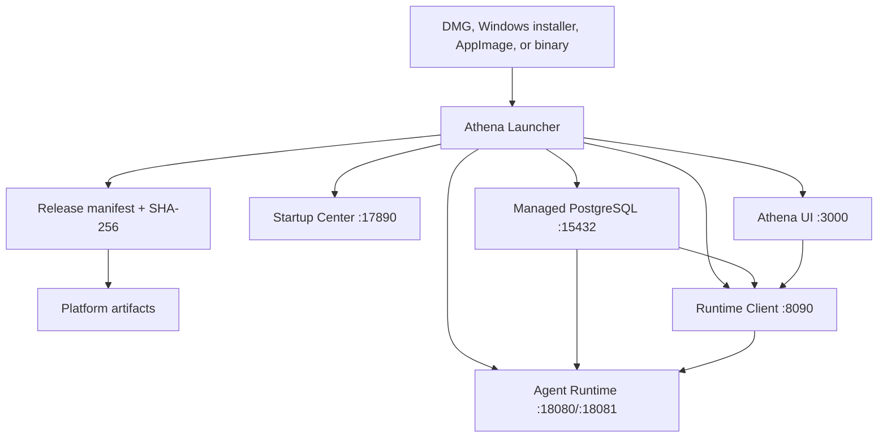

# Athena Launcher

[English](README.md) | [简体中文](README.zh-CN.md)

Athena Launcher is the desktop installer and local service manager for the Athena agent platform. A user downloads one package for their operating system; the launcher installs a private PostgreSQL instance, downloads verified Runtime/Client/UI artifacts, generates compatible configuration, starts every service in order, and opens a visual startup center.

The launcher itself uses only the Go standard library and builds as a single executable.

## What It Manages

- Detects macOS, Linux, or Windows and `amd64`/`arm64` automatically.
- Downloads PostgreSQL, Agent Runtime, Agent Runtime Client, and Athena Agent UI for the current platform.
- Verifies every artifact against its SHA-256 value in `release-manifest.json`.
- Initializes PostgreSQL in `~/.athena` with a random password and creates the `agent_runtime` database.
- Generates matching Runtime, Client, and Skills configuration files.
- Starts PostgreSQL, Runtime, Client, and UI in dependency order and checks health endpoints.
- Shows installation, startup, update, and live-log progress at `http://127.0.0.1:17890`.
- Serves the UI at `http://127.0.0.1:3000`.
- Monitors managed services and restarts unexpected exits.
- Compares local and remote package hashes on launch and asks before updating.
- Reuses verified packages and preserves PostgreSQL/user data across service upgrades.

## Architecture



Startup sequence:

1. Load and validate the release manifest for the detected platform.
2. Download missing/changed packages and verify SHA-256.
3. Generate or reuse the local PostgreSQL cluster and credentials.
4. Generate service configuration without overwriting the database data directory.
5. Start PostgreSQL, Runtime, Client, then the UI.
6. Wait for health checks and open Athena when every component is ready.

## Install for End Users

Download the latest package from [GitHub Releases](https://github.com/good-fish-man/athena-launcher/releases/latest):

| Platform | Package |
| --- | --- |
| Apple Silicon Mac | `Athena_<version>_macOS_arm64.dmg` |
| Intel Mac | `Athena_<version>_macOS_amd64.dmg` |
| Windows 10/11 x64 | `Athena-Setup_<version>_windows_amd64.exe` |
| Linux x86-64 | `Athena_<version>_linux_x86_64.AppImage` |
| Linux ARM64 | `Athena_<version>_linux_aarch64.AppImage` |

### macOS

Open the DMG, drag **Athena** into Applications, and launch it. Public builds currently use ad-hoc signing unless release secrets are configured. If macOS reports that Apple cannot verify the app, right-click Athena and choose **Open**, or allow it in **System Settings > Privacy & Security**. Production distribution should use Developer ID signing and notarization.

### Windows

Run the installer, then open Athena from the Start menu or desktop shortcut. Production releases should be Authenticode-signed to avoid SmartScreen warnings.

### Linux

Mark the AppImage as executable and run it:

```bash
chmod +x Athena_<version>_linux_x86_64.AppImage
./Athena_<version>_linux_x86_64.AppImage
```

The first launch can take several minutes because PostgreSQL and service packages are downloaded and initialized.

## Startup Center and Logs

The launcher opens the startup center immediately. It displays manifest, package, configuration, database, Runtime, Client, and UI steps. On failure, select a log source, copy the error, fix the cause, and choose **Retry startup**.

Default files:

```text
~/.athena/
├── config/                 generated service configuration
├── data/postgres/          persistent PostgreSQL data
├── data/uploads/           uploads and generated reports
├── data/skills/            user skills
├── logs/launcher.log
├── logs/postgres.log
├── logs/agent-runtime.log
├── logs/agent-runtime-client.log
├── packages/               verified downloads
├── services/               versioned service installations
├── state.json
└── startup-status.json
```

Updating a PostgreSQL package does not delete `data/postgres`. Service packages and configuration can be replaced independently from user data.

## Command Line

Desktop packages call the same command-line application internally:

```bash
athena-launcher launch
athena-launcher start
athena-launcher status
athena-launcher stop
athena-launcher update
```

| Command | Purpose |
| --- | --- |
| `launch` | Start if needed and open Startup Center/Athena |
| `start` | Start the managed launcher in the background |
| `run` | Run in the foreground for debugging or a service manager |
| `install` | Download and prepare packages/configuration only |
| `update` | Prepare the latest manifest packages |
| `validate` | Validate a manifest for the current platform |
| `status` | Print component health |
| `stop` | Gracefully stop the managed launcher and services |
| `version` | Print launcher and platform version |

Common options and environment variables:

```bash
athena-launcher run --home /custom/athena --manifest /path/to/release-manifest.json
athena-launcher validate --manifest https://example.com/release-manifest.json

export ATHENA_HOME="$HOME/.athena"
export ATHENA_MANIFEST_URL="https://example.com/release-manifest.json"
```

A production launcher embeds its release manifest URL during compilation. Development builds can use an absolute local path or a localhost HTTP URL. Public remote manifests must use HTTPS.

## Updates and Recovery

At startup, the launcher compares installed hashes with the current manifest. If packages differ, the startup center asks the user before stopping existing processes and installing new versions. Matching packages are reused and are not downloaded twice.

If a port is occupied by a process recorded as Athena's managed process, the launcher stops that process before restart. It does not silently terminate unrelated applications. Use Startup Center logs and `athena-launcher status` to identify conflicts.

To reset only downloaded service packages, stop Athena and remove the relevant version under `~/.athena/services` or `~/.athena/packages`; do not remove `~/.athena/data` unless user data should also be erased.

## Build from Source

Requirements: Go 1.24 or newer. The launcher has no third-party Go module dependencies.

```bash
git clone https://github.com/good-fish-man/athena-launcher.git
cd athena-launcher
make test
make build
```

Build all launcher binaries:

```bash
make release VERSION=0.1.0 \
  MANIFEST_URL=https://github.com/good-fish-man/athena-launcher/releases/download/v0.1.0/release-manifest.json
```

Build desktop formats with the scripts in `packaging/macos`, `packaging/windows`, and `packaging/linux`, or run the repository's `Release` GitHub Actions workflow.

## Release Manifest

[`release-manifest.example.json`](release-manifest.example.json) documents the schema. Each database, frontend, and service artifact declares:

- Platform key such as `darwin-arm64` or `windows-amd64`.
- HTTPS URL.
- 64-character SHA-256.
- Archive format and executable path.
- Service order and health URL where applicable.

The `services` list is generic. Additional local workers can be added without changing the launcher:

```json
{
  "name": "local-worker",
  "order": 30,
  "args": ["--config", "{config}/worker.yaml"],
  "env": {"ATHENA_HOME": "{home}"},
  "health_url": "http://127.0.0.1:19000/healthz",
  "artifacts": {}
}
```

Arguments support `{home}`, `{config}`, and `{install}` placeholders.

## Release Order

For a new `vX.Y.Z` release:

1. Publish the same tag in `agent-runtime`.
2. Publish the same tag in `agent-runtime-client`.
3. Publish the same tag in `athena-agent-ui`.
4. Run **Publish Release Manifest** in this repository to collect assets, package PostgreSQL, calculate hashes, and publish `release-manifest.json`.
5. Run or complete **Release** to publish raw launchers, DMGs, Windows installer, and AppImages with the manifest URL embedded.

Repository-scoped GitHub tokens cannot create releases in the other repositories, so their releases must exist before manifest publication.

## Security

- Managed PostgreSQL listens only on `127.0.0.1:15432`.
- The generated database password is stored in mode `0600` configuration/state files.
- Artifact hashes are mandatory.
- Archive extraction rejects absolute paths and `..` traversal.
- Updates replace versioned installation directories, not `~/.athena/data`.
- Remote manifests require HTTPS.
- Protect release-manifest write access and configure platform code signing for public distribution.

## Related Projects

- [`agent-runtime`](https://github.com/good-fish-man/agent-runtime)
- [`agent-runtime-client`](https://github.com/good-fish-man/agent-runtime-client)
- [`athena-agent-ui`](https://github.com/good-fish-man/athena-agent-ui)

## License

Add a repository license before public redistribution. PostgreSQL and packaged service dependencies retain their own licenses.
