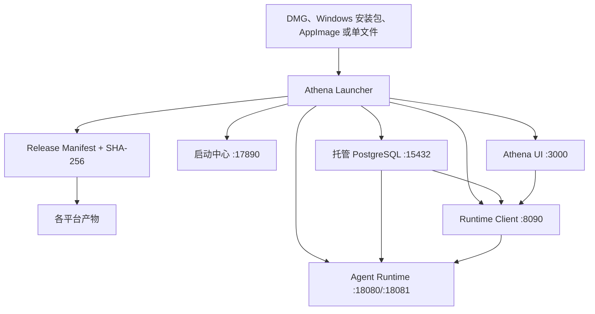

# Athena Launcher

[English](README.md) | [简体中文](README.zh-CN.md)

Athena Launcher 是 Athena Agent 平台的桌面安装器和本地服务管理器。用户只需下载与操作系统匹配的一个安装包；Launcher 会安装独立 PostgreSQL，下载并校验 Runtime、Client、UI，生成相互兼容的配置，按顺序启动服务，并打开可视化启动中心。

Launcher 本身只使用 Go 标准库，可以编译为单个可执行文件。

## 管理的内容

- 自动识别 macOS、Linux、Windows 和 `amd64`/`arm64`。
- 下载当前平台的 PostgreSQL、Agent Runtime、Agent Runtime Client 和 Athena Agent UI。
- 使用 `release-manifest.json` 中的 SHA-256 校验所有产物。
- 在 `~/.athena` 初始化 PostgreSQL，随机生成密码并创建 `agent_runtime` 数据库。
- 自动生成匹配的 Runtime、Client 和 Skills 配置。
- 按 PostgreSQL、Runtime、Client、UI 的依赖顺序启动并执行健康检查。
- 在 `http://127.0.0.1:17890` 展示安装、启动、更新和实时日志。
- 在 `http://127.0.0.1:3000` 提供 Athena UI。
- 监控托管服务，并在异常退出后自动重启。
- 每次启动比较本地与远程包 Hash，更新前由用户确认。
- 复用已校验的安装包，并在服务更新时保留 PostgreSQL 和用户数据。

## 架构



启动流程：

1. 读取发布清单，并验证当前平台是否有可用产物。
2. 下载缺失或变化的包并校验 SHA-256。
3. 创建或复用本地 PostgreSQL 数据目录和凭据。
4. 生成服务配置，不覆盖数据库数据目录。
5. 依次启动 PostgreSQL、Runtime、Client 和 UI。
6. 等待所有健康检查通过，然后进入 Athena。

## 普通用户安装

从 [GitHub Releases](https://github.com/good-fish-man/athena-launcher/releases/latest) 下载最新安装包：

| 平台 | 安装包 |
| --- | --- |
| Apple Silicon Mac | `Athena_<version>_macOS_arm64.dmg` |
| Intel Mac | `Athena_<version>_macOS_amd64.dmg` |
| Windows 10/11 x64 | `Athena-Setup_<version>_windows_amd64.exe` |
| Linux x86-64 | `Athena_<version>_linux_x86_64.AppImage` |
| Linux ARM64 | `Athena_<version>_linux_aarch64.AppImage` |

### macOS

打开 DMG，把 **Athena** 拖入 Applications 后启动。如果发布流程未配置正式签名，macOS 可能提示 Apple 无法验证应用。可右键 Athena 选择 **打开**，或在 **系统设置 > 隐私与安全性** 中允许。正式公开分发应配置 Developer ID 签名和公证。

### Windows

运行安装程序，然后从开始菜单或桌面快捷方式启动。正式发布建议配置 Authenticode 签名，避免 SmartScreen 警告。

### Linux

为 AppImage 添加执行权限后运行：

```bash
chmod +x Athena_<version>_linux_x86_64.AppImage
./Athena_<version>_linux_x86_64.AppImage
```

首次启动需要下载并初始化 PostgreSQL 与服务包，可能耗时几分钟。

## 启动中心与日志

Launcher 会立即打开启动中心，展示 Manifest、安装包、配置、数据库、Runtime、Client 和 UI 步骤。失败时可切换日志来源、复制错误，处理原因后点击 **重试启动**。

默认目录：

```text
~/.athena/
├── config/                 自动生成的服务配置
├── data/postgres/          持久化 PostgreSQL 数据
├── data/uploads/           上传和生成的报告
├── data/skills/            用户 Skills
├── logs/launcher.log
├── logs/postgres.log
├── logs/agent-runtime.log
├── logs/agent-runtime-client.log
├── packages/               已校验的下载包
├── services/               按版本安装的服务
├── state.json
└── startup-status.json
```

更新 PostgreSQL 安装包不会删除 `data/postgres`。服务程序、配置和用户数据位于不同目录，可独立更新。

## 命令行

桌面安装包内部调用的也是同一个命令行程序：

```bash
athena-launcher launch
athena-launcher start
athena-launcher status
athena-launcher stop
athena-launcher update
```

| 命令 | 用途 |
| --- | --- |
| `launch` | 按需启动并打开启动中心或 Athena |
| `start` | 在后台启动托管 Launcher |
| `run` | 前台运行，适合调试或系统服务管理器 |
| `install` | 只下载和准备包/配置 |
| `update` | 准备最新 Manifest 中的安装包 |
| `validate` | 验证当前平台的 Manifest |
| `status` | 输出各组件健康状态 |
| `stop` | 优雅停止 Launcher 和托管服务 |
| `version` | 输出 Launcher 和平台版本 |

常用参数和环境变量：

```bash
athena-launcher run --home /custom/athena --manifest /path/to/release-manifest.json
athena-launcher validate --manifest https://example.com/release-manifest.json

export ATHENA_HOME="$HOME/.athena"
export ATHENA_MANIFEST_URL="https://example.com/release-manifest.json"
```

正式 Launcher 会在编译时写入 Manifest URL。开发版本可使用绝对本地路径或 localhost HTTP 地址；公网远程 Manifest 必须使用 HTTPS。

## 更新与恢复

启动时，Launcher 会比较已安装 Hash 与当前 Manifest。如果包发生变化，启动中心会先征求用户同意，再停止旧进程并安装新版本。Hash 相同的包会复用，不会重复下载。

如果端口由 Athena 记录的托管进程占用，Launcher 会在重启前停止该进程；不会静默结束其他应用。可使用启动中心日志和 `athena-launcher status` 定位端口冲突。

如果只想重置下载的服务包，应先停止 Athena，再删除 `~/.athena/services` 或 `~/.athena/packages` 中对应版本；除非希望同时清除用户数据，否则不要删除 `~/.athena/data`。

## 从源码构建

需要 Go 1.24 或更高版本。Launcher 没有第三方 Go Module 依赖。

```bash
git clone https://github.com/good-fish-man/athena-launcher.git
cd athena-launcher
make test
make build
```

构建全部平台单文件：

```bash
make release VERSION=0.1.0 \
  MANIFEST_URL=https://github.com/good-fish-man/athena-launcher/releases/download/v0.1.0/release-manifest.json
```

桌面格式由 `packaging/macos`、`packaging/windows` 和 `packaging/linux` 中的脚本构建，也可直接运行仓库的 `Release` GitHub Actions 工作流。

## Release Manifest

[`release-manifest.example.json`](release-manifest.example.json) 展示了完整结构。数据库、前端和服务产物需要声明：

- `darwin-arm64`、`windows-amd64` 等平台 Key。
- HTTPS 下载地址。
- 64 位十六进制 SHA-256。
- 压缩格式和可执行文件路径。
- 服务启动顺序和健康检查地址。

`services` 是通用有序列表，可以不修改 Launcher 就添加新的本地服务：

```json
{
  "name": "local-worker",
  "order": 30,
  "args": ["--config", "{config}/worker.yaml"],
  "env": {"ATHENA_HOME": "{home}"},
  "health_url": "http://127.0.0.1:19000/healthz",
  "artifacts": {}
}
```

参数支持 `{home}`、`{config}` 和 `{install}` 占位符。

## 发布顺序

发布新的 `vX.Y.Z`：

1. 在 `agent-runtime` 发布相同 Tag。
2. 在 `agent-runtime-client` 发布相同 Tag。
3. 在 `athena-agent-ui` 发布相同 Tag。
4. 在本仓库运行 **Publish Release Manifest**，收集产物、打包 PostgreSQL、计算 Hash 并发布 `release-manifest.json`。
5. 运行或完成 **Release**，发布嵌入 Manifest URL 的单文件、DMG、Windows 安装包和 AppImage。

GitHub Token 默认只能操作当前仓库，因此其他三个仓库的 Release 必须先存在。

## 安全边界

- 托管 PostgreSQL 只监听 `127.0.0.1:15432`。
- 随机数据库密码保存在权限为 `0600` 的配置/状态文件中。
- 所有下载产物都必须匹配 SHA-256。
- 解压时拒绝绝对路径和 `..` 路径穿越。
- 更新替换版本化安装目录，不删除 `~/.athena/data`。
- 远程 Manifest 必须使用 HTTPS。
- 公开发布时应保护 Manifest 写权限，并配置平台代码签名。

## 相关项目

- [`agent-runtime`](https://github.com/good-fish-man/agent-runtime)
- [`agent-runtime-client`](https://github.com/good-fish-man/agent-runtime-client)
- [`athena-agent-ui`](https://github.com/good-fish-man/athena-agent-ui)

## 许可证

公开分发前请为仓库补充许可证。PostgreSQL 和打包的服务依赖继续使用各自许可证。
