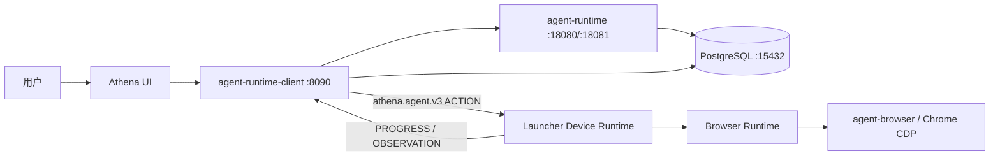

# Athena Launcher 启动、浏览器与函数指南

本文面向需要开发、启动、排障或扩展 `athena-launcher` 的工程师。内容以当前源码为准，重点说明：

- Launcher 如何选择命令、安装组件、生成配置和启动服务；
- 本地模式与远程模式如何连接 Runtime Client；
- Release Manifest、公钥、Hash 与更新恢复如何协作；
- `agent-browser` 二进制、浏览器数据、Chrome Profile 和凭据分别存放在哪里；
- 浏览器 Action 如何从控制面到达本机并返回 Observation；
- 启动和浏览器生产代码中各函数的职责。

测试文件中的测试函数不在本文逐项列出。极小的解析、排序和数值裁剪函数按所在函数组说明，避免把调用链拆成无法阅读的字典。

## 1. 项目定位

Athena Launcher 同时承担四个角色：

1. **安装器**：读取 Release Manifest，下载并校验 PostgreSQL、`agent-browser`、Runtime、Runtime Client 和 UI。
2. **进程管理器**：生成配置，按依赖顺序启动服务，执行健康检查，并监管异常退出。
3. **桌面宿主**：在 Wails WebView 中先显示启动中心，准备完成后切换到 Athena UI。
4. **设备执行端**：主动连接 Runtime Client 的 WebSocket 控制面，在本机执行浏览器、桌面应用和文件能力。

它不负责理解自然语言，也不直接运行模型。自然语言意图、规划和能力选择在 Agent Runtime；Launcher 只执行已经结构化、经过策略判定的 Action。



## 2. 目录与持久化边界

默认安装根目录由 `ATHENA_HOME` 决定；未设置时是 `~/.athena`。

```text
~/.athena/
├── state.json                         安装状态、版本、模式和机器身份
├── installed-manifest.json            当前已安装并验证的 Manifest
├── config/                            自动生成的 Runtime/Client/Skills 配置
├── secrets/                           恢复密钥、设备 ID 和初始管理员密码
├── postgres/<version>/                版本化 PostgreSQL 程序
├── services/<service>/<version>/      版本化服务程序
├── browser/<version>/agent-browser    版本化浏览器控制程序
├── browser/authenticated-profile/     auto_connect 专用 Chrome 用户目录
├── browser/screenshots/               浏览器截图
├── frontend/<version>/                版本化 UI
├── data/postgres/                     PostgreSQL 数据
├── data/browser-runtime-state.json    浏览器 Workspace/Session/Tab 元数据
├── data/browser-automation-v3.json    浏览器自动化规则
├── data/device-action-journal-v4.json 设备动作幂等与恢复日志
├── downloads/                         下载中的 Release 产物
├── backups/                           升级前恢复点
└── logs/                              Launcher、服务和浏览器日志
```

`agent-browser` 自身的 Vault、Cookie 和会话数据默认不在版本目录中，而在 `~/.agent-browser`。实际路径会在首次启动时写入：

```text
~/.athena/state.json
~/.athena/secrets/browser-data.path
```

因此从 `~/.athena/browser/0.34.0/agent-browser` 升级到新版本时，替换的是**程序**，不是**数据**。只要不删除 `~/.agent-browser`、`browser-data.path` 和 `browser-vault.key`，历史登录态不会因为二进制升级而主动丢失。

## 3. 从源码启动

### 3.1 前置条件

- Go 版本以 `go.mod` 为准，当前为 Go 1.25；
- 桌面构建需要 Wails v2 的系统依赖；
- `make desktop-run` 默认从相邻目录 `../frontend/agent-ui` 构建前端；
- 本地模式会下载 Manifest 中声明的组件，需要能够访问产物地址；
- 远程模式需要一个健康的 Runtime Client，并允许桌面 UI 的 CORS 请求。

### 3.2 最小验证

```bash
cd /Users/dom/agent-ui/athena-launcher
go test ./...
go run ./cmd/athena-launcher version
go run ./cmd/athena-launcher validate
```

源码已经固定官方 Release Ed25519 公钥。使用默认官方 Manifest 时，不需要设置 `ATHENA_RELEASE_PUBLIC_KEY`。

### 3.3 CLI/无界面构建

```bash
make build
./dist/athena-launcher start
./dist/athena-launcher status
./dist/athena-launcher stop
```

- `start` 派生后台 `run` 进程，日志写入 `~/.athena/logs/log`；
- `run` 在前台运行，适合终端调试和服务管理器；
- 非 `desktop` 构建的 `launch` 会启动后台进程，并用系统默认浏览器打开 `http://127.0.0.1:17890/`。

### 3.4 Wails 桌面开发

```bash
make desktop-run
```

此命令依次执行：

1. `npm --prefix ../frontend/agent-ui run build`；
2. 构建带 `desktop,production,devtools` Tag 的 Launcher；
3. macOS 上打包 `dist/Athena.app`；
4. 使用 `--frontend-dir <agent-ui/dist>` 启动桌面应用。

仓库不在默认相邻布局时：

```bash
make desktop-run FRONTEND_PROJECT=/absolute/path/to/agent-ui
```

### 3.5 指定 Home、Manifest 和本地前端

```bash
go run ./cmd/athena-launcher run \
  --home /private/tmp/athena-dev \
  --manifest /absolute/path/release-manifest.json \
  --frontend-dir /absolute/path/agent-ui/dist
```

开发 Manifest 应设置 `development: true`。它可以引用绝对本地文件，并跳过 Release 签名验证，但仍会执行 JSON Schema 约束、平台、路径、大小和 SHA-256 校验。远程 Manifest 禁止使用 `development: true`。

## 4. 命令和启动路径

### 4.1 命令入口

```text
cmd/athena-launcher.main
  -> internal/launcher.Run
    -> deployment.Run
      -> launch | start | run | install | update | validate | stop | status
```

| 命令 | 运行行为 |
| --- | --- |
| `launch` | `desktop` 构建打开 Wails；普通构建打开浏览器启动中心。 |
| `start` | 启动分离的后台 `run` 子进程。 |
| `run` | 前台运行完整管理循环。 |
| `install` / `update` | 只执行 Manifest、下载、校验和配置准备，不长期运行服务。 |
| `validate` | 验证当前平台 Manifest、签名、GA 约束、SBOM 与兼容矩阵。 |
| `stop` | 写入 `stop.request`，等待被管理的 Launcher 优雅退出。 |
| `status` | 检查记录的 PID、TCP 端口和 HTTP 健康端点。 |
| `readiness` | 输出 GA 安装、签名、备份和恢复就绪度 JSON。 |
| `version` | 输出 Launcher 版本和 `GOOS-GOARCH`。 |

普通构建没有显式命令时默认 `start`；带 `desktop` Tag 的构建默认 `launch`。

### 4.2 本地模式完整调用链

```text
runForeground
  ├─ startHeadlessDeviceRuntime
  ├─ startStartupServer
  └─ runManaged
       ├─ prepareWithTracker
       │    ├─ loadState
       │    ├─ loadManifest
       │    ├─ installDatabase
       │    ├─ installBrowser
       │    ├─ installServices
       │    ├─ installFrontend
       │    └─ writeGeneratedConfigs
       ├─ managedDatabase.Start
       ├─ supervisor.StartAll
       ├─ desktopAssetSwitch.UseFrontend 或 startFrontendServer
       └─ supervisor.Run
```

关键顺序不可交换：Runtime 和 Runtime Client 依赖 PostgreSQL；Client 又依赖 Runtime 的 gRPC/HTTP；UI 最后才切换到可用状态。

### 4.3 远程模式

远程模式仍在本地运行 UI、Device Runtime 和 Browser Runtime，但不会安装或启动本地 PostgreSQL、Agent Runtime 和 Runtime Client。

```text
runManaged
  -> runRemoteManaged
       ├─ prepareRemote
       │    ├─ loadManifest
       │    ├─ installBrowser（失败时允许系统浏览器降级）
       │    └─ installFrontend
       ├─ checkRemoteClient(<remote>/healthz)
       ├─ 显示本地 UI
       └─ waitRemoteMode
```

Device Runtime 使用 `ws://` 或 `wss://` 主动连接远端 Runtime Client。公网远端地址必须使用 HTTPS/WSS；只有回环地址允许 HTTP/WS。

### 4.4 启动中心状态机

`startupTracker` 是线程安全的启动状态模型。每一步由 `begin`、`complete` 或 `fail` 更新，快照写入 `startup-status.json`，并通知 Wails 资产切换器。

常见状态：

```text
waiting_deployment -> starting -> ready
                         |
                         +-> error -> retry -> starting

update:none -> checking -> available -> protecting -> applying
```

启动中心 API 包括状态、日志、重试、部署模式、浏览器设置、打开登录浏览器和更新控制。桌面构建通过同一个 Wails Asset Handler 提供这些接口，不需要监听 `17890`；CLI 构建才启动本地启动中心 HTTP Server。

## 5. Manifest、签名和更新

### 5.1 信任顺序

`loadManifest` 的验证顺序是：

1. 从本地文件或 HTTPS 下载 JSON；必要时回退到同目录的 `release-manifest.zip`；
2. 严格 JSON 解码，拒绝未知字段和多个根值；
3. `Manifest.Validate` 校验结构、平台、路径和 Artifact 元数据；
4. `Manifest.ValidateGA` 校验协议版本、最低升级版本和必需组件；
5. 生产 Manifest 使用 Ed25519 公钥验证签名和有效期；
6. 远程生产 Manifest 下载并校验 SBOM；
7. GA Release 下载并校验兼容矩阵；
8. 每个 Artifact 下载后校验精确字节数、SHA-256、归档安全和平台代码签名。

### 5.2 为什么公钥不是运行时远程下载

公钥是信任根。若 Manifest 和公钥从相同远程位置同时下载，攻击者替换 Manifest 时也能替换公钥，签名就失去意义。因此：

- 官方远程 Manifest 只接受编译进 Launcher 的 `DefaultReleasePublicKey`；
- `ATHENA_RELEASE_PUBLIC_KEY` 只允许覆盖**本地**签名 Manifest，供发布流水线和集成测试使用；
- 本地 `development: true` Manifest 不要求签名；
- 若官方构建仍报 `release public key is not configured`，说明构建时把 `DefaultReleasePublicKey` 清空了，或执行的不是当前源码构建产物。

检查实际二进制：

```bash
go run ./cmd/athena-launcher validate
./dist/athena-launcher version
which athena-launcher
```

### 5.3 原子更新和恢复

Artifact 先进入临时下载文件，再解压到 staging 目录。`replaceArtifactDirectory` 会保留 `.rollback`，新目录激活失败时恢复旧目录。更新已经运行的本地服务前，`runForeground` 先创建并验证加密 PostgreSQL 恢复点；失败则不进入更新。

版本目录和数据目录分开，所以更新服务程序不会删除：

- `~/.athena/data/postgres`；
- `~/.agent-browser` 或自定义 Browser Home；
- `~/.athena/secrets`；
- `~/.athena/data/skills`。

## 6. 浏览器系统

### 6.1 两个“浏览器”概念

| 概念 | 用途 | 主要函数 |
| --- | --- | --- |
| 系统默认浏览器 | CLI 构建打开 Launcher 启动中心；`agent-browser` 缺失时只支持简单 URL 打开。 | `OpenSystemURL`、`openSystemURL`、`openBrowser` |
| Athena 受控浏览器 | 执行 `browser.*` Action，保留 Session，观察页面并验证动作。 | `Controller.RunAction`、`RunTask`、`ManageAutomation` |

系统默认浏览器降级不具备点击、输入、观察、截图或会话验证能力。完整能力必须有 `agent-browser`。

### 6.2 二进制解析优先级

`browserController.executable` 按以下顺序寻找 `agent-browser`：

1. `ATHENA_AGENT_BROWSER_BIN`；
2. `state.json` 中 `Installed["agent-browser"]` 指向的版本目录；
3. `~/.athena/browser/*/agent-browser*` 中可用版本；
4. `PATH` 中的 `agent-browser`。

`ATHENA_AGENT_BROWSER_BIN` 是开发、测试或受管子进程的**进程级覆盖**，所以从环境变量读取。安装版本由 Manifest 和 `state.json` 管理，不适合再放进业务数据库。Launcher 启动 Runtime/Client 时会把已校验的绝对路径注入该环境变量，保证所有进程使用同一版本。

### 6.3 数据目录和密钥优先级

Browser Home 的解析优先级是：

1. `ATHENA_AGENT_BROWSER_HOME`；
2. `AGENT_BROWSER_HOME`；
3. `state.BrowserDataDir`；
4. 首次安装默认 `~/.agent-browser`。

首次解析后，`state.Load` 用 `reconcileSecret` 将绝对路径和 Vault Key 同时保存在受保护的状态与恢复文件中。两份值不一致时拒绝静默轮换，避免“看似升级、实际换了 Vault”的数据丢失。

### 6.4 三种认证模式

| 模式 | 参数 | 数据来源 | 适用场景 |
| --- | --- | --- | --- |
| 隔离模式 | `isolated` | Athena 私有持久状态，Session 使用 `--restore`。 | 默认、安全隔离、无需已有登录。 |
| Profile 快照 | `profile` | 选择本机 Chrome Profile，通过 `--profile` 导入快照。 | 尝试复用已有登录；不会回写个人 Profile。 |
| 自动连接 | `auto_connect` | `--auto-connect` 连接已打开的 CDP Chrome。 | 需要真实登录、受保护媒体或人工接管。 |

启动中心的“打开登录浏览器”会启动官方 Chrome：

```text
--remote-debugging-port=9222
--remote-debugging-address=127.0.0.1
--user-data-dir=~/.athena/browser/authenticated-profile
```

该 Profile 是稳定目录，不在 `browser/<version>` 下。Chrome 由用户拥有，Launcher 关闭 `auto_connect` Session 时只释放 Athena 本地状态，不杀掉用户 Chrome。

### 6.5 Action 到 Observation

```text
Runtime Client
  -- ACTION --> deviceRuntime.connectEndpoint
                   -> runAction
                   -> execute
                   -> executeCapability
                   -> desktopBridge.browserSession
                   -> Controller.RunTask / RunAction / ManageAutomation
                   -> agent-browser CLI / Chrome CDP
                   -> Perception Layer
                   -> Observation + Attachment
  <-- PROGRESS / OBSERVATION -- deviceWriter.Send
```

执行端会检查协议、设备租约、Fencing Token、Capability Instance、Deadline、Idempotency Key 和本地最低风险。`ASK_USER` 返回 `WAITING_APPROVAL`，验证码、登录或反爬挑战返回 `WAITING_USER`，不会绕过网站安全机制。

### 6.6 Session、Workspace、Window 和 Tab

- **Workspace**：当前实现把普通浏览统一归入默认工作区；
- **Session**：跨多轮 Action 的逻辑会话，ID 为 `athena-` 加 32 个十六进制字符；
- **Window**：记录可见窗口身份；
- **Tab**：从真实 `agent-browser tab list --json` 对账，保存活动标签页 URL 和标题；
- **Runtime State**：只保存元数据，不保存原始 Cookie、密码、完整 DOM 或截图字节。

普通 `browser.open` 会优先复用现有 Session，并在同一窗口打开或切换 Tab。只有 `new_session`、`newSession` 或 `isolated` 显式为真时才强制新 Session。

### 6.7 高层 Task 和底层 Action

- `RunAction` 执行一个明确动作，例如 `navigate`、`click`、`type` 或 `screenshot`；
- `RunTask` 把一个受限目标拆成多步确定性动作，并受动作预算约束；
- `ManageAutomation` 管理持久化触发器、动作和验证规则；
- Browser Runtime 不调用 LLM，站点发现需要精确 URL 时返回结构化 capability handoff，由 Agent Runtime 的 Search 能力解析后续接。

每次动作后都进入 Perception Layer：先整理页面/标签/Cookie 摘要，再构建 UI Tree、页面模式和语义页面，按需截图/OCR/空间定位，最后生成增量差异、验证与恢复建议。

## 7. 配置与环境变量

| 变量 | 作用 | 优先级/边界 |
| --- | --- | --- |
| `ATHENA_HOME` | Launcher 安装和数据根目录。 | 覆盖 `~/.athena`。 |
| `ATHENA_MANIFEST_URL` | 默认 Manifest 文件或 URL。 | 被 `--manifest` 覆盖。 |
| `ATHENA_FRONTEND_DIR` | 本地 UI `dist`。 | 仅开发用途，被 `--frontend-dir` 覆盖。 |
| `ATHENA_DATABASE_PORT` | PostgreSQL 端口。 | 必须为 1-65535。 |
| `ATHENA_RELEASE_PUBLIC_KEY` | 本地签名 Manifest 的测试公钥。 | 不能覆盖远程官方信任根。 |
| `ATHENA_AGENT_BROWSER_BIN` | `agent-browser` 可执行文件。 | 高于安装状态和 PATH。 |
| `ATHENA_BROWSER_EXECUTABLE_PATH` / `AGENT_BROWSER_EXECUTABLE_PATH` | auto-connect 登录窗口使用的 Chrome 可执行文件。 | 高于操作系统默认 Chrome 路径。 |
| `ATHENA_AGENT_BROWSER_HOME` | Browser 数据目录。 | 高于 `AGENT_BROWSER_HOME` 和持久状态。 |
| `AGENT_BROWSER_HOME` | `agent-browser` 原生数据目录变量。 | Launcher 会与 Athena 变量同步。 |
| `AGENT_BROWSER_ENCRYPTION_KEY` | Browser Vault Key。 | 由 Launcher 状态注入托管进程。 |
| `ATHENA_BROWSER_AUTH_MODE` | `isolated/profile/auto_connect`。 | 环境覆盖启动中心保存值。 |
| `ATHENA_BROWSER_PROFILE` / `AGENT_BROWSER_PROFILE` | Chrome Profile 路径或标识。 | 高于状态中的 Profile。 |
| `AGENT_BROWSER_SOCKET_DIR` | Unix daemon socket/PID 目录。 | 默认按 Athena Home Hash 放在 `/tmp`。 |
| `AGENT_BROWSER_IDLE_TIMEOUT_MS` | 受管浏览器空闲时间。 | 非 auto-connect 默认 30 分钟。 |

## 8. 启动函数参考

### 8.1 入口与参数

| 函数 | 说明 |
| --- | --- |
| `cmd/athena-launcher.main` | 把 CLI 参数交给 `launcher.Run`；错误写 stderr 并以状态码 1 退出。 |
| `launcher.Run` | 很薄的包门面，把调用转给 `deployment.Run`。 |
| `deployment.Run` | 校验环境覆盖、解析命令和 Flag、规范化路径，再分派具体命令。 |
| `printUsage` | 输出命令和基础环境变量帮助。 |
| `defaultCommand` | 按 Build Tag 返回默认命令：桌面为 `launch`，普通构建为 `start`。 |
| `defaultHome` | 读取 `ATHENA_HOME`，否则返回 `~/.athena`。 |
| `defaultManifest` | 按环境变量、编译注入 URL、二进制同目录、本地 Home 的顺序选择 Manifest。 |
| `platformKey` | 生成 Manifest 平台键，例如 `darwin-arm64`。 |
| `databasePort` | 返回合法的数据库端口，未配置时使用 15432。 |
| `validateRuntimeOverrides` / `configuredPort` | 严格解析并校验端口环境变量。 |

### 8.2 部署选择

| 函数 | 说明 |
| --- | --- |
| `normalizeDeployment` | 规范化 `local/remote`，拒绝远端 URL 中的凭据、Query、Fragment 和不安全 HTTP。 |
| `isLoopbackHost` | 判断 localhost、Wails localhost 或回环 IP。 |
| `savedDeploymentSelection` | 从持久状态恢复部署选择，未配置时返回本地模式。 |
| `deploymentFromState` | 容错读取部署选择，非法状态降级为本地模式。 |
| `deploymentSelectionRequired` | 判断桌面启动前是否必须让用户重新选择部署方式。 |

### 8.3 生命周期与主编排

| 函数 | 说明 |
| --- | --- |
| `startDetached` | 复用已运行的启动中心，或派生后台 `run` 子进程并重定向日志。 |
| `runForeground` | 建立信号 Context、设备运行时和启动中心，循环处理启动失败、重试和更新。 |
| `startHeadlessDeviceRuntime` | 为 CLI 模式创建本机设备执行端并异步运行。 |
| `waitForDeviceRuntime` | 关闭时限时等待浏览器 Session 释放。 |
| `runManaged` | 本地模式总编排：准备包、启动数据库、生成配置、启动服务和 UI。 |
| `clearUpdateWhenCurrent` | 已无更新时清理启动中心的更新状态。 |
| `runSupervisor` | 进入服务监管循环，并提供重新加载远程 Manifest 的更新检查函数。 |
| `stopManaged` | 写 `stop.request`，轮询状态直到原 Launcher PID 清零。 |
| `printStatus` | 输出本地或远程组件健康状态。 |
| `watchStopRequest` | 每 500ms 检查停止文件，命中后取消根 Context。 |
| `healthyURL` / `tcpReachable` | 分别进行 HTTP 和 TCP 存活探测。 |
| `startupCenterHealthy` | 检查 CLI 启动中心 `/healthz`。 |
| `requestStartupUpdateCheck` | 向已运行启动中心发送非阻塞更新检查请求。 |
| `statusLabel` | 把布尔健康状态格式化为 `running/stopped`。 |
| `configureDetachedProcess` | 按平台为后台 Launcher 配置独立进程属性。 |
| `terminationSignals` | 返回当前平台用于优雅关闭的信号集合。 |

### 8.4 桌面应用与资产切换

| 函数 | 说明 |
| --- | --- |
| `launchDesktop` | 桌面构建创建 Wails 应用；普通构建启动后台服务后打开系统浏览器。 |
| `desktopApplication.startup` | 保存 Wails Context，并启动后台服务编排。 |
| `desktopApplication.run` | 等待部署选择，启动 Device Runtime，处理更新和重试循环。 |
| `startDeviceRuntime` | 保证每个桌面应用只创建一个设备运行时。 |
| `shutdown` / `cancelServices` / `requestShutdown` | 取消服务、等待释放浏览器并退出 Wails。 |
| `showStartup` / `showUpdateCheck` / `focusWindow` | 切换启动中心、触发检查并把单实例窗口带到前台。 |
| `handleSnapshot` | 根据更新状态自动在启动中心和 Athena UI 间切换。 |
| `stopLegacyLauncher` | 桌面接管前停止旧的浏览器式 Launcher。 |
| `redirectDesktopLogs` | 把桌面进程 stdout/stderr 重定向到 Launcher 日志。 |
| `newDesktopAssetSwitch` | 创建 Wails Asset Handler 的启动中心/UI 路由器。 |
| `SetDesktopBridge` | 注入桌面权限和文件夹选择 HTTP Bridge。 |
| `UseFrontend` | 验证 `index.html` 后设置 UI 根目录。 |
| `ShowStartup` / `ShowFrontend` | 原子切换当前显示的资产集合。 |
| `desktopAssetSwitch.ServeHTTP` | 路由桌面 Bridge、启动 API、启动页和 SPA 静态资源。 |

### 8.5 准备、下载和安装

| 函数 | 说明 |
| --- | --- |
| `prepare` | 无启动中心的安装/更新入口，并按持久状态选择本地或远程准备。 |
| `prepareWithTracker` | 本地准备总流程，串联 Manifest、更新批准、组件安装和配置生成。 |
| `loadManifest` | 读取、解码并完整验证 Manifest，处理旧格式 ZIP 回退。 |
| `readManifestSource` / `readSource` / `readLimited` | 有大小上限地读取 HTTPS、本地或 `file://` 数据。 |
| `decodeManifestData` / `decodeStrictJSON` / `unpackManifest` | 解压可选 ZIP，并严格解码单个 JSON 根值。 |
| `isZipArchive` | 通过 ZIP Magic Bytes 判断 Manifest 是否为压缩包。 |
| `validateLoadedManifest` | 组合结构、GA、签名、SBOM 和兼容矩阵验证。 |
| `verifyReleaseCompatibility` / `verifyReleaseCompatibilityData` | 下载兼容矩阵，校验 Hash 和组件版本。 |
| `compareReleaseSemver` | 比较 Launcher 使用的三段 Release 语义版本。 |
| `configuredReleasePublicKey` / `releasePublicKeyForSource` | 选择固定信任根；只允许本地来源使用环境覆盖。 |
| `verifyReleaseSBOM` | 下载并校验 Release SBOM Hash。 |
| `remoteManifestSource` | 判断来源是否为 HTTP(S)。 |
| `manifestArchiveFallback` / `manifestArchiveSibling` / `legacyManifestError` | 处理旧 Manifest 发布兼容和可操作错误。 |
| `installDatabase` / `installBrowser` / `installServices` / `installFrontend` | 复用匹配 Hash 的已验证目录，否则安装当前平台 Artifact。 |
| `findArtifactRootByMarker` / `findInstalledExecutable` | 用 `.artifact-sha256` 和文件名发现可复用安装。 |
| `installArtifact` | 下载到临时文件、校验、解压到 staging，再原子激活。 |
| `downloadFile` / `copyExact` | 强制 Content-Length 和实际复制字节数与 Manifest 一致。 |
| `validateDownloadURL` / `validateDownloadRedirect` | 阻止凭据 URL、非回环 HTTP、私网 HTTPS 和协议降级。 |
| `verifySHA256` | 流式计算并比较 Artifact SHA-256。 |
| `extractArtifact` / `extractZIP` / `extractTarGZ` | 解压 raw、ZIP 或 tar.gz，并拒绝不支持的 Entry。 |
| `safeArchivePath` / `validateArchiveSymlink` | 防止路径穿越和逃逸目标目录的符号链接。 |
| `archiveBudget.reserve` / `writeArchiveFileExact` | 限制 Entry 数、单文件和总展开大小，并校验写入字节数。 |
| `copyPath` | 用指定权限复制本地 raw Artifact。 |
| `replaceArtifactDirectory` | 通过 staging/rollback 原子替换版本目录。 |
| `databaseArtifactMarker` / `frontendRoot` / `shortHash` | 分别生成数据库 Marker、UI 根目录和日志短 Hash。 |

### 8.6 配置、数据库和服务监管

| 函数 | 说明 |
| --- | --- |
| `writeGeneratedConfigs` | 创建目录并生成 Runtime、Client 和 Skills YAML，注入数据库、插件、备份等路径。 |
| `ensureBackupKey` | 验证 64 字符恢复密钥并写入受保护文件。 |
| `yamlString` / `writeAtomic` | 安全引用 YAML 字符串，并通过临时文件替换配置。 |
| `newManagedDatabase` | 组装 PostgreSQL 程序、数据和日志路径。 |
| `managedDatabase.Start` | 校验程序、初始化数据目录、同步密码、启动并等待可用。 |
| `managedDatabase.Stop` | 使用 `pg_ctl` 优雅停止受管数据库。 |
| `initialize` / `createDatabase` / `syncPassword` | 初始化 Cluster、创建业务库并同步本地用户密码。 |
| `runningFromData` | 确认当前运行实例使用的是 Athena 数据目录。 |
| `validateBinaries` / `binary` / `optionalBinary` | 定位并验证 PostgreSQL 必需或可选程序。 |
| `quoteIdentifier` / `quoteLiteral` | 为数据库初始化 SQL 做标识符和字面量转义。 |
| `portAvailable` | 检查数据库监听端口能否绑定。 |
| `newSupervisor` | 保存 Manifest、程序路径、配置和需要注入的本机密钥。 |
| `supervisor.StartAll` | 先处理端口占用，再按 Manifest `order` 启动服务。 |
| `supervisor.start` | 展开参数、构造环境、启动单个进程并等待健康检查。 |
| `supervisor.Run` | 处理退出重启、更新检查、延期和应用更新。 |
| `supervisor.StopAll` | 逆序发送中断信号，超时后强制终止。 |
| `supervisor.service` | 按名称查找 Manifest ServiceSpec。 |
| `waitHTTP` | 等待健康端点、进程退出、Context 取消或超时。 |
| `macOSServicePath` | 为 Finder/Wails 启动环境补全 Homebrew 和 `/usr/local` 路径。 |
| `setEnvironmentValue` | 删除同名旧变量后追加唯一值。 |
| `effectiveManagedBrowserDataDir` / `managedBrowserEnvironment` | 解析稳定 Browser Home，并向托管服务注入 Home 和 Vault Key。 |
| `expandValues` / `expandValue` | 展开 Manifest 参数中的 `{home}`、`{config}` 和 `{install}`。 |

### 8.7 启动中心、远程模式和前端

| 函数 | 说明 |
| --- | --- |
| `newStartupController` | 创建重试、部署选择和更新控制 Channel。 |
| `newStartupTracker` / `reset` | 创建或重置启动快照和标准步骤。 |
| `awaitDeployment` / `deploymentError` / `deploymentConfigured` | 维护部署选择阶段的状态。 |
| `checkingForUpdates` / `offerUpdate` / `applyingUpdate` | 维护更新检查、待确认和应用状态。 |
| `protectingUpdate` / `updateProtectionError` | 展示升级前恢复点创建状态。 |
| `clearUpdate` / `updateError` | 清空更新或记录检查错误。 |
| `begin` / `complete` / `fail` / `ready` | 更新单个启动步骤及整体状态。 |
| `current` / `stepLocked` / `touchLocked` | 读取快照、定位步骤并更新时间。 |
| `persist` / `listen` | 原子写入状态文件并注册桌面快照监听器。 |
| `startStartupServer` / `startupHandler` | CLI 模式监听 17890，并构造全部启动中心路由。 |
| `acceptStartupAction` / `signalStartupAction` | 校验 POST 控制请求并进行非阻塞 Channel 通知。 |
| `startupServer.Stop` | 优雅关闭启动中心 HTTP Server。 |
| `startupLogPath` / `tailFile` / `writeStartupJSON` | 白名单选择日志、读取尾部并输出 JSON。 |
| `runRemoteManaged` | 远程模式总编排：检查服务、显示 UI、进入更新等待。 |
| `prepareRemote` | 只准备本地 Browser/UI，不安装数据库和 Runtime 服务。 |
| `checkRemoteClient` / `checkRemoteClientWithHTTPClient` | 带超时检查远端 `/healthz`。 |
| `waitRemoteMode` | 处理远程模式的 UI 更新 Channel。 |
| `startFrontendServer` | CLI 模式监听 UI 地址并提供 SPA。 |
| `frontendServer.Stop` | 优雅关闭 UI HTTP Server。 |
| `spaHandler` | 提供静态文件，未知路由回退到 `index.html`，拒绝隐藏路径。 |

### 8.8 状态与密钥

| 函数 | 说明 |
| --- | --- |
| `state.Load` | 读取 `state.json`，补齐并核对数据库、Browser、备份、内部 Token、管理员密码和 Device ID。 |
| `resolveBrowserDataDir` | 解析 Browser Home 环境覆盖，并返回绝对清理路径。 |
| `reconcileSecret` | 对比状态值与 `secrets/` 恢复副本；不一致时拒绝身份轮换。 |
| `readSecret` / `readProtectedFile` | 限制大小、文件类型和 Unix 权限，并防止打开期间文件替换。 |
| `randomSecret` | 使用 `crypto/rand` 生成十六进制随机值。 |
| `state.Save` | JSON 序列化状态；标记为 `json:"-"` 的管理员密码不会写入状态文件。 |
| `writeSecret` / `writeProtectedFile` | 用 `0600` 临时文件、`fsync` 和 Rename 持久化敏感数据。 |
| `loadState` / `saveState` | Deployment 包对 `internal/state.Load/Save` 的薄适配层。 |

### 8.9 更新、端口、日志和就绪度

| 函数 | 说明 |
| --- | --- |
| `checkPackageUpdates` / `checkFrontendUpdates` | 比较 Manifest Hash 与各版本目录的 `.artifact-sha256`，生成更新列表。 |
| `installedFrontendUsable` / `installedPackagesUsable` | 判断旧版本 UI 或整套组件能否在用户暂缓更新时继续运行。 |
| `appendPackageUpdate` | 忽略已存在同 Hash 版本，只记录真实变化的组件。 |
| `saveInstalledManifest` / `loadInstalledManifest` | 原子保存当前 Manifest；加载时重新执行结构和生产签名验证。 |
| `validateInstalledPackages` | 检查 PostgreSQL、Browser、Services、Frontend 的 Marker、程序和入口文件。 |
| `normalizeFrontendOverride` | 把本地前端路径转为绝对路径，并要求存在 `index.html`。 |
| `packageUpdatesForOptions` / `frontendUpdatesForOptions` | 使用本地前端时从更新检查中移除 UI 包。 |
| `withoutPackageComponent` | 从更新列表过滤指定组件。 |
| `managedServicePorts` | 从 Service Health URL 收集需要在启动前检查的回环端口。 |
| `prepareManagedServicePorts` | 识别端口拥有者；只终止可证明属于当前 Athena Home 的旧进程。 |
| `isAthenaManagedProcess` | 结合 PID、程序参数、Home、配置和安装路径判断进程归属。 |
| `findPortOwner` / `parseLsofOwner` / `processArgs` | 使用各平台工具查询监听 PID、程序名和参数。 |
| `terminatePortOwner` / `waitPortAvailable` / `processStillExists` | 终止已确认的旧进程，并等待端口真正释放。 |
| `ownerLabel` | 格式化端口拥有者供错误和日志展示。 |
| `launcherResponseWriter.WriteHeader` / `Write` | 记录 HTTP 响应状态和写入行为。 |
| `requestErrorLogger` | 只记录 5xx 请求，避免健康检查产生高频正常日志。 |
| `launcherReadiness` | 汇总安装身份、Manifest、组件、备份、签名和前端独立性检查。 |
| `countBackupManifests` / `authenticatedManagedRecoveryInventory` | 统计逻辑备份，并逐个认证受管恢复点。 |
| `platformSigningReadiness` | 检查当前平台所有 Artifact 是否都有签名/公证证据。 |
| `launcherCheck` / `launcherAggregateStatus` | 构造检查项，并按 Fail、Blocked、External Required 等优先级聚合状态。 |
| `verifyInstalledCodeSignature` | macOS/Windows 校验安装后程序的平台签名；其他平台当前为空实现。 |

### 8.10 更新前恢复点

| 函数或函数组 | 说明 |
| --- | --- |
| `createManagedPostgresRecoveryPoint` | 用安装级备份密钥创建并立即验证冷 PostgreSQL 恢复点。 |
| `verifyManagedPostgresRecoveryPoint` / `inspectManagedPostgresRecoveryPoint` | 解密、校验 Manifest MAC、文件 Hash 和归档结构，但不恢复数据。 |
| `restoreManagedPostgresRecoveryPoint` | 验证后解压到 staging，并原子替换 PostgreSQL 数据目录。 |
| `newManagedRecoveryStore` | 校验 Home、Key 和版本后创建恢复存储对象。 |
| `managedRecoveryStore.create` / `verify` / `restore` | 实现恢复点创建、验证和恢复的主体事务。 |
| `loadAuthenticated` | 加载 Manifest，验证 HMAC、Key ID、文件大小和 SHA-256。 |
| `prune` | 按保留策略删除最旧恢复点。 |
| `ensureColdManagedPostgresData` | 要求数据库已经停止，避免复制不一致的热数据目录。 |
| `readManagedPostgresVersion` | 从 `PG_VERSION` 读取数据格式版本。 |
| `writeManagedPostgresArchive` / `skipManagedPostgresArchivePath` | 流式打包数据，排除 PID、Socket 和临时运行文件。 |
| `inspectManagedPostgresArchive` / `extractManagedPostgresArchive` / `consumeManagedPostgresArchive` | 复用同一安全解析器检查或提取归档。 |
| `safeManagedRecoveryArchiveName` | 拒绝绝对路径、路径穿越和非法归档名称。 |
| `replaceManagedDataDirectory` | 使用 staging/rollback 原子切换数据库数据目录。 |
| `encryptManagedRecovery` / `decryptManagedRecovery` | 使用分块 AES-GCM 流式加解密备份。 |
| `managedRecoveryGCM` / `managedRecoveryAAD` | 创建 AEAD，并把 Backup ID 与块序号绑定为附加认证数据。 |
| `decodeManagedRecoveryKey` / `managedRecoveryKeyID` | 解码安装密钥并计算不泄露原 Key 的标识。 |
| `newManagedRecoveryID` | 用时间和随机数生成受格式约束的恢复点 ID。 |
| `managedRecoveryFileSHA256` / `managedRecoveryManifestDigest` | 计算加密文件和规范 Manifest 摘要。 |
| `sealManagedRecoveryManifest` / `authenticateManagedRecoveryManifest` | 写入并校验 Manifest HMAC。 |
| `managedRecoveryManifestMAC` | 对排除 MAC 字段后的规范内容计算 HMAC-SHA256。 |
| `writeManagedRecoveryManifest` / `readManagedRecoveryManifest` | 以受保护文件保存和严格读取恢复 Manifest。 |
| `copyManagedRecoveryContext` | 流式复制时持续响应 Context 取消。 |

### 8.11 Provider Registry、Action Journal 和附件

| 函数 | 说明 |
| --- | --- |
| `ensurePluginRegistry` | 创建共享 Provider 包、Registry、Trust Store、审计和签名目录。 |
| `createLocalPluginSigningIdentity` | 首次生成稳定 Ed25519 本机身份，并分别保护私钥与公钥。 |
| `fileExists` | 判断 Registry 初始化文件是否已经存在。 |
| `loadDeviceActionJournal` | 严格读取持久动作 Journal，补齐 Map 并验证版本。 |
| `saveDeviceActionJournal` | 用临时文件保存 Completed、InFlight 和 Sequence。 |
| `beginDurableAction` | 执行前记录 InFlight 和序号，阻止旧 Revision/Sequence。 |
| `remember` | 执行后将 Observation 写入幂等缓存并从 InFlight 移除。 |
| `releaseDurableAction` | 等待审批时释放 InFlight，使同一动作以后能够恢复。 |
| `journalLocked` | 在持锁状态下生成可序列化 Journal 快照。 |
| `collectObservationAttachments` | 只从 Athena 截图根目录收集最多两个验证后的图片附件。 |
| `collectArtifactPaths` | 有界递归查找 Observation 中声明的 Artifact 路径。 |
| `readObservationAttachment` | 拒绝符号链接和超大文件，验证 MIME，计算 Hash 并编码 Base64。 |
| `redactObservationAttachmentPaths` | 附件读取后从状态树删除本机绝对路径。 |
| `pathWithinRoot` / `screenshotMIMEType` | 验证截图属于允许根目录，并按扩展名限定图片类型。 |

### 8.12 Desktop Bridge 的非浏览器函数

| 函数 | 说明 |
| --- | --- |
| `desktopBridge.ServeHTTP` | 提供桌面可用性和原生文件夹选择接口。 |
| `authorizeRoot` / `authorizedRoots` | 持久保存并返回用户明确授权的文件搜索根目录。 |
| `normalizeDesktopRoots` | 转绝对路径、解析符号链接、要求目录存在并去重。 |
| `searchDesktopFiles` | 在访问数、结果数和 Context 边界内搜索文件名或内容。 |
| `skipDesktopDirectory` | 跳过隐藏目录、VCS、依赖和 IDE 缓存目录。 |
| `searchDesktopContent` | 只扫描不超过大小限制的文件，并返回首个匹配行和裁剪片段。 |
| `validateDesktopApplication` | 只接受应用名称，拒绝路径、URL、参数和 Shell 语法。 |
| `launchDesktopApplication` / `launchDesktopApplicationName` | 使用受限平台命令启动指定桌面应用。 |
| `runDesktopLauncher` | 运行平台启动器并保留可读 stderr。 |
| `activeDesktopApplication` / `activeDesktopWindowTitle` | 通过平台可访问性接口读取当前应用和窗口标题。 |
| `runDesktopSessionAction` | 对已登记的应用 Session 分派激活、观察、按键、输入和关闭。 |
| `activateDesktopApplication` | 激活 Session 绑定的进程或应用。 |
| `sendDesktopKey` / `typeDesktopText` | 使用平台自动化接口发送受限按键或文字。 |
| `closeDesktopApplication` | 关闭 Session 绑定应用，而不是执行任意进程命令。 |
| `writeDesktopError` / `writeDesktopJSON` | 统一 Desktop Bridge JSON 响应。 |

### 8.13 Release Manifest 函数

| 函数 | 说明 |
| --- | --- |
| `Manifest.Validate` | 验证 Schema、版本、有效期、平台 Artifact、URL、Hash、路径，并按 `order` 排序服务。 |
| `Manifest.ValidateGA` | 对 v1.0+ 强制协议、最低升级版本、兼容矩阵和必需组件。 |
| `validateArtifact` / `validateArtifactURL` | 校验单个 Artifact 的安全来源、大小、Hash、签名状态、格式和程序路径。 |
| `validCodeSigning` / `validSHA256` / `validSignature` | 验证平台签名枚举、SHA-256 和协议签名字段。 |
| `validateHTTPSURL` | 要求 SBOM/兼容矩阵等生产资源使用无凭据 HTTPS。 |
| `Manifest.Sign` | 为全部 Artifact 和 Manifest 规范载荷生成 Ed25519 签名。 |
| `Manifest.Verify` | 校验 Key ID、Artifact 签名、Manifest 签名和有效期。 |
| `signingPayload` / `artifactSigningPayload` | 生成字段顺序稳定、与传输格式无关的签名载荷。 |
| `decodeSignature` / `DecodePublicKey` / `DecodePrivateKey` | 严格解码 Base64 Ed25519 材料并检查长度。 |
| `ReleaseKeyID` | 从公钥 Hash 生成可展示的 Key ID。 |
| `AllowsUpgradeFrom` / `compareSemver` | 比较语义版本并判断是否允许原地升级。 |
| `validateRelativePath` | 拒绝绝对路径和 `..`，保护安装目标。 |
| `cmd/release-manifest-sign.main` | 发布工具入口：加载私钥、读取 Manifest、签名并原子回写。 |
| `currentPlatform` | 从 Manifest Artifact 集合推断签名工具当前平台。 |
| `atomicWrite` / `fatal` | 原子保存签名结果，并统一发布工具错误退出。 |

## 9. 设备与浏览器函数参考

### 9.1 Device Runtime

| 函数 | 说明 |
| --- | --- |
| `newDeviceRuntime` | 从部署状态构造 WebSocket 端点，加载持久 Action Journal，并绑定 Desktop Bridge。 |
| `deviceRuntimeToken` | 本地模式使用内部服务 Token；远程模式优先使用远程 Device Token。 |
| `deviceWebSocketURL` / `deviceWebSocketURLs` | 把 Client HTTP(S) 地址转换为兼容的 WS(S) 控制端点候选。 |
| `deviceRuntime.Run` | 持续连接控制面，断线后指数退避，稳定连接后重置退避。 |
| `connect` / `connectEndpoint` | 尝试端点，发送 HELLO，校验 WELCOME 租约，运行心跳和消息循环。 |
| `shutdownBrowser` | Device Runtime 退出时限时释放所有受管浏览器 Session。 |
| `setLease` / `currentLease` / `acceptsLease` | 原子维护并校验 Lease Owner、Fencing Token 和过期时间。 |
| `probeDeviceEndpoint` | WebSocket 失败时用 HTTP 请求生成更明确的鉴权错误。 |
| `runAction` | 防止同一 Action 并发重复执行，转发 Progress 并发送最终 Observation。 |
| `cancelAction` | 用保存的 CancelFunc 取消正在执行的 Action。 |
| `deviceWriter.Send` | 用互斥锁串行化 WebSocket JSON 写入。 |
| `capabilities` / `capabilityInstances` | 枚举桌面、文件和浏览器能力及实例。 |
| `capabilityOperation` / `capabilityInstanceID` | 生成协议 Operation 和设备级稳定实例 ID。 |
| `execute` | 执行协议、租约、实例、Deadline、幂等和风险检查，再持久化结果。 |
| `deviceObservationError` | 把 FAILED、CANCELLED、EXPIRED Observation 转为 Span 可记录的 Error。 |
| `minimumDeviceRisk` / `raiseDeviceRisk` | 保证本机风险只能提高，不能被服务端错误降级。 |
| `validDevicePolicy` | 检查风险和决策是否属于协议允许枚举。 |
| `executeCapability` | 把 `browser.*`、`app.*` 和 `file.search` 分派到具体本机实现。 |
| `browserChallengeDetected` / `browserUserInterventionDetected` | 从浏览器状态识别验证码、登录和人工接管。 |
| `browserChallengeMessage` / `browserUserInterventionMessage` | 生成用户可读的等待原因。 |
| `semanticTraceArgument` / `stringSliceArgument` / `intArgument` / `boolArgument` | 安全读取 Action Arguments。 |
| `browserSessionTargetKey` | 从 target、URL、Query、Goal 或 Engine 推导 Session 关联键。 |
| `newDeviceBrowserSessionID` / `newDeviceAppSessionID` / `randomDeviceHex` | 生成浏览器和桌面应用 Session ID。 |

### 9.2 Desktop Bridge 与 Browser Controller 边界

| 函数 | 说明 |
| --- | --- |
| `newDesktopBridge` / `newDesktopBridgeWithState` | 创建文件授权、桌面会话和 Browser Controller；有状态时注入稳定数据目录与 Vault Key。 |
| `desktopBridge.browserSession` | 串行解析/创建 Session，并记录活动 Session。 |
| `clearBrowserSession` | 关闭 Controller Session 并清除活动引用。 |
| `shutdownBrowser` | 请求 Controller 释放全部 Session。 |
| `browser_runtime.NewController` | 创建使用默认持久化参数的 Controller。 |
| `NewControllerWithPersistence` | 创建 Controller 后注入 Launcher 持久化的 Browser Home 和加密 Key。 |
| `Controller.RunAction` | 执行单个底层浏览器动作。 |
| `Controller.RunTask` | 执行有计划和预算的高层浏览器任务。 |
| `Controller.ManageAutomation` | 创建、列出、启停、删除或检查自动化规则。 |
| `Controller.Shutdown` | 关闭受管 Session；auto-connect 不终止用户 Chrome。 |
| `ResolveSession` / `CloseSession` | 解析或关闭 Runtime Session，并清理自动化、锁和感知基线。 |
| `SessionArgs` | 生成 namespace、session、认证模式、Profile 和浏览器程序参数。 |
| `Capabilities` / `Available` | 返回能力列表，并判断完整浏览器执行是否可用。 |
| `SettingsFromState` / `ApplySettings` | 在启动中心 JSON 与持久状态之间读取/校验浏览器设置。 |

### 9.3 浏览器安装、设置与 Chrome 登录窗口

| 函数 | 说明 |
| --- | --- |
| `installBrowser` | 按 Manifest Hash 复用或原子安装版本化 `agent-browser`。 |
| `browserSettingsFromState` | 合并状态、环境覆盖和本机 Chrome Profile 目录，生成设置响应。 |
| `applyBrowserSettings` | 校验认证模式和 Profile 存在性后更新状态。 |
| `browserProfileFromState` | 按环境、持久设置和默认隔离目录解析有效 Profile。 |
| `browserProfileStatus` | 生成 Profile 可用性及 Windows Cookie 加密等告警。 |
| `discoverChromeProfiles` / `chromeUserDataCandidates` | 在各操作系统的标准位置发现 Chrome User Data。 |
| `readChromeProfileCatalog` | 读取 Chrome `Local State`，提取目录、名称、账号和最近使用项。 |
| `chromeProfileCatalog.resolve` | 按目录、显示名或账号唯一解析 Profile；歧义时报错。 |
| `isBrowserProfilePath` / `expandBrowserProfilePath` / `directoryExists` | 识别、展开并校验自定义 Profile 路径。 |
| `StartAuthenticatedChrome` | 串行启动专用 Chrome，等待 9222 CDP 就绪并返回 PID/日志。 |
| `authenticatedChromeResult` / `authenticatedChromeArgs` | 构造稳定 Profile、Debug URL、日志和 Chrome 参数。 |
| `browserCDPReady` | 访问 `/json/version` 并验证 WebSocket Debugger URL。 |
| `localPortAvailable` | 启动前确认 9222 没被非 CDP 进程占用。 |

### 9.4 命令环境与进程清理

| 函数 | 说明 |
| --- | --- |
| `browserController.browserCommand` | 用 Context 创建 `agent-browser` 子进程，并注入一致环境。 |
| `browserCommandEnvironment` / `configuredBrowserCommandEnvironment` | 组装 Home、Vault Key、Idle Timeout 和 Socket 目录。 |
| `effectiveAgentBrowserDataDir` | 环境覆盖优先，否则使用 Controller 注入的数据目录。 |
| `setBrowserEnvironmentValue` | 保证子进程环境中每个键只有一个值。 |
| `agentBrowserSocketDirectory` | 为 Athena Home 生成短而隔离的 Unix Socket/PID 目录。 |
| `managedBrowserDaemonPID` | 从受管 namespace 读取并校验 Session daemon PID。 |
| `stopManagedBrowserDaemon` | 二次核对 PID 后终止 Launcher 拥有的 daemon；不处理 auto-connect Chrome。 |
| `cleanupManagedBrowserDaemonFiles` | 删除该 Session 的受管 socket/PID 临时文件。 |
| `processAlreadyExited` | 统一识别各平台“进程已结束”错误。 |
| `browserController.executable` | 按环境、安装状态、版本目录和 PATH 解析 `agent-browser`。 |

### 9.5 Controller 动作执行

| 函数或函数组 | 说明 |
| --- | --- |
| `newBrowserController` | 组装 Runtime、Perception、Task Planner、Target Resolver 和 Automation Engine。 |
| `runAction` / `browserSessionLock` | 按 Session 串行 Action，失败时把 Session 标记为 ERROR。 |
| `runActionUnlocked` | 核心动作分派器；执行 navigate/click/type/scroll/download 等命令并观察结果。 |
| `browserCommandOperation` | 从 CLI 参数提取真实操作名，用于超时和错误信息。 |
| `runIdempotentBrowserCommand` | 执行可安全重复的浏览器命令。 |
| `runBrowserNavigationCommand` / `activateExactBrowserTarget` | 执行导航，并在不确定失败后通过实际 Tab 对账恢复。 |
| `waitForBrowserDocumentTransition` / `browserDocumentTransitioned` | 轮询 URL/标题，确认点击等动作是否发生文档切换。 |
| `isRecoverableBrowserConnectionError` / `clearStaleBrowserSessionConfig` | 识别陈旧 daemon 连接并清理该 Session 配置后重试一次。 |
| `browserOpenArgs` / `browserAgentSessionActive` / `shouldRestartBrowserAsHeaded` | 决定复用、可见启动或重启现有会话。 |
| `prepareBrowserRefreshTarget` | 刷新前在实时和持久 URL 之间确定安全目标。 |
| `observeBrowser` / `browserObservation` | 获取 URL、标题、内容和 Accessibility Snapshot，再进入感知层。 |
| `runDownload` / `browserDownloadFileSnapshot` / `browserDownloadProgress` | 执行下载，观察临时文件增长并发送进度。 |
| `reusableBrowserTabRef` / `parseBrowserCommandTabs` / `scoreReusableBrowserTab` | 对账并评分现有 Tab，避免重复窗口和标签页。 |
| `browserOpenMode` / `browserTabLabel` / `safeBrowserTabLabel` | 解析打开方式并生成安全标签。 |
| `browserAuthMode` / `normalizeBrowserAuthMode` / `browserProfile` | 解析当前认证模式和 Profile。 |
| `preferredBrowserExecutable` / `defaultBrowserExecutableCandidates` | 查找用于 auto-connect 登录窗口的 Chrome 可执行文件。 |
| `capabilities` / `available` / `runSystemBrowserFallback` | 声明能力，并在控制器不可用时只降级简单 URL 打开。 |
| `detectBrowserChallenge` / `detectBrowserIntervention` / `annotateBrowserIntervention` | 识别验证码、认证和人工接管并写入状态。 |
| `browserKeyElements` / `parseBrowserElementLine` / `mergeBrowserKeyElements` | 把 Snapshot 中的 `@eN` 语义 Ref 规范化为有界元素列表。 |
| `validateBrowserTarget` | 只允许无内嵌凭据的绝对 HTTP(S) URL。 |
| `truncateBrowserOutput` / `cleanBrowserCommandOutput` | 对 CLI 输出去噪并限制大小。 |

### 9.6 Browser Runtime 状态管理

| 函数 | 说明 |
| --- | --- |
| `browser.NewRuntime` | 创建各 Manager，初始化状态文件并加载已有 Workspace/Session。 |
| `Runtime.load` / `saveLocked` | 读取和保存 `browser-runtime-state.json`；重启后把运行态降为 PAUSED。 |
| `Runtime.SessionArgs` | 根据认证模式生成 `--restore`、`--profile` 或 `--auto-connect` 参数。 |
| `Runtime.ResolveSession` | 在锁内委托 Session Manager 解析或创建 Session。 |
| `Runtime.CloseSession` | 标记 Session 关闭并持久化。 |
| `HasSessionContent` | 判断 Session 或任一 Tab 是否已有 URL/标题。 |
| `IsHeaded` / `WasLoadedHeaded` / `RequiresHeadedLaunch` / `SetHeaded` | 管理“当前是否可见启动”的进程级事实。 |
| `SetSessionStatus` / `normalizeSessionStatus` | 只接受预定义 Session 状态并持久化。 |
| `Snapshot` | 返回不暴露内部可变对象的 Session 摘要。 |
| `PrepareDownload` | 为 Download 动作生成安全默认路径并创建目录。 |
| `DecorateObservation` | 运行 Tab/Cookie/Session/Window/DOM/Download Provider，更新状态并组装 `browser_runtime`。 |
| `enrichTakeoverRecovery` | 为人工接管写入同 Session 恢复说明。 |
| `CaptureScreenshot` / `browserScreenshotArtifact` | 执行有界截图并计算附件 Hash、MIME 和元数据。 |

Manager 函数：

| 函数组 | 说明 |
| --- | --- |
| `browserProfileManager.resolve` | 返回当前认证模式、Profile 路径和程序路径。 |
| `browserWorkspaceManager.ensureLocked` / `observationLocked` | 创建默认 Workspace，并输出只读观察。 |
| `browserWindowManager.updateLocked` / `probe` / `observationLocked` | 对账窗口活动状态。 |
| `browserTabManager.probe` / `updateLocked` / `observationLocked` | 读取真实 Tab 列表并维护活动 Tab。 |
| `browserNavigationManager.updateLocked` | 从动作和观察更新当前 URL/标题。 |
| `browserDOMObserver.probe` / `enrichLocked` | 获取 Snapshot 并生成有界 key elements。 |
| `browserDownloadManager.directory` / `probe` / `enrichLocked` / `observationLocked` | 管理下载目录、文件状态和观察摘要。 |
| `browserCookieManager.probe` / `observationLocked` | 只输出 Cookie 数量、Domain 和 Session 摘要，不输出值。 |
| `browserSessionManager.resolveLocked` | 处理显式、活动、稳定默认和强制新 Session。 |
| `ensureLocked` / `ensureWithIDLocked` / `linkSessionLocked` | 建立 Session、Workspace 和 Tab 的关系。 |
| `activateLocked` / `closeLocked` / `nextOpenSessionLocked` | 切换活动 Session、关闭和选择后继 Session。 |
| `observationLocked` / `probe` | 输出 Session 观察，并用真实浏览器状态校正持久状态。 |

### 9.7 Task Planner、目标解析和交互验证

| 函数或函数组 | 说明 |
| --- | --- |
| `newBrowserTaskPlanner` / `Plan` | 把已结构化请求变成确定性 Task Plan 和最大动作数。 |
| `newBrowserTaskExecutionBudget` / `consume` / `snapshot` | 创建、扣减并报告动作预算，防止循环失控。 |
| `runTask` | 高层任务总流程：推断任务、打开目标、站内搜索、解析结果、执行并收尾。 |
| `inferBrowserTask` 及 `infer*` 函数组 | 从已有 Goal/Target/Query 补齐动作、目标、查询、序号和媒体类型；不是通用 LLM 意图识别。 |
| `openTaskTarget` / `discoverAndOpenTaskTarget` | 打开精确 URL；只有站点名时先尝试观察证据，否则请求 Search handoff。 |
| `browserTaskCapabilityHandoff` | 生成 `athena.capability-handoff.v3`，要求服务端搜索精确官网后续接原 Session。 |
| `searchWithinTaskTarget` | 使用页面语义搜索框或站点知识执行站内搜索。 |
| `openFirstTaskResult` / `resolveTaskResult` | 解析指定序号的结果，并按风险阈值决定执行、重观察或询问用户。 |
| `taskCandidate*` / `semanticTaskCandidate` / `nth*Candidate` | 从媒体、内容、语义页面和结构化 Feed 中生成候选。 |
| `finishTask` | 附加 Plan、执行轨迹、候选诊断和最终错误。 |
| `newBrowserTargetResolver` / `browserCandidateResolver.Resolve` | 收集可操作候选并归一化证据。 |
| `browserTargetResolver.Resolve` | 计算语义、类型、序号、来源、视觉和空间分数，输出决策。 |
| `browserCandidate*Evidence` / `browserCandidateConfidence` | 计算候选级证据和总置信度。 |
| `browserResolutionThresholds` | 根据风险提高执行和重观察阈值。 |
| `runTaskAction` | 应用本地策略，执行动作，验证失败时仅对可逆动作重观察并重试一次。 |
| `browserTaskActionPolicy` | 按动作、标签和参数确定是否允许、询问用户或阻止。 |
| `browserSensitiveActionLabel` / `browserSensitiveInputLabel` | 识别登录、购买、提交、密码和验证码等敏感目标。 |
| `browserInteractionVerified` / `browserInteractionPostcondition` | 用 Perception Verification 和动作特定后置条件确认结果。 |
| `browserInteractionRetryable` / `browserInteractionRetryArguments` | 限制重试类型，并把重试绑定到同一页面。 |
| `finishBrowserInteractionReport` | 写入尝试次数、耗时、验证和恢复结果。 |

### 9.8 Perception Layer

| 文件/函数组 | 说明 |
| --- | --- |
| `perception_layer.go`: `newPerceptionLayer` | 组装 Browser Observation Engine、Runtime、Orchestrator 和 OCR Provider。 |
| `ObserveBrowser` / `browserObservationEngine.Observe` | 装饰原始状态，按需获取元素框，再运行统一感知编排。 |
| `perceptionRequest` / `clonePerceptionArguments` | 把执行请求转换成感知请求，并隔离截图参数修改。 |
| `orchestrator.Observe` | 感知总流程：分类、意图信号、预算、语义、UI Tree、模式、页面模型、截图、验证和恢复。 |
| `classifier.go` 函数组 | 分类错误页、挑战页、搜索页等，并从动作参数提取视觉/OCR/空间需求。 |
| `adaptive.go` 函数组 | 根据页面、意图和已有证据调整观察预算。 |
| `semantic.go` 函数组 | 解析 `@eN` 元素和 Bounding Box，排序、裁剪内容并生成兼容元素。 |
| `ui_tree.go` 函数组 | 从扁平元素推断区域、节点类型、URL 语义、交互性和稳定 ID。 |
| `patterns.go` 函数组 | 识别搜索、登录、Profile、媒体、集合、分页和商务模式。 |
| `page_model.go` 函数组 | 构建页面实体、分区和可执行 Interaction；`SemanticPage`、`EntityAt`、`InteractionCandidates` 提供只读查询。 |
| `incremental.go` 函数组 | 保存 Session 基线，计算增删改，验证动作并生成恢复计划；`ClearSession` 删除基线。 |
| `visual.go` 函数组 | 决定截图、标注和 OCR，并报告不可用原因。 |
| `spatial.go` / `spatial_perception_provider.go` | 解析 Bounding Box、选择有限 Ref，并从浏览器查询元素几何信息。 |
| `target_grounding.go` 函数组 | 解释颜色、相对方向和锚点，计算候选专属视觉/空间证据。 |
| `resource_identity.go` 函数组 | 为观察附加稳定资源 ID、版本和感知指纹。 |
| `stabilization.go` 函数组 | 对需要稳定性的动作轮询观察，直到指纹稳定或超时。 |
| `ocr_perception_provider.go` 函数组 | 只允许读取 Athena 截图目录内的图片，调用系统 OCR 并裁剪输出。 |

### 9.9 内容、媒体与建议动作

| 函数组 | 说明 |
| --- | --- |
| `enrichBrowserContentCandidates` / `parseBrowserContentCandidates` | 从页面结构提取文档、文章等内容候选。 |
| `resolveObservedContentURL` / `isAuxiliaryContentCandidate` | 规范化相对 URL，并过滤辅助、Facet 或噪声链接。 |
| `enrichBrowserMediaCandidates` / `parseBrowserMediaCandidates` | 提取视频、歌曲和播放列表候选。 |
| `browserMediaIdentity` / `stableBrowserMediaID` | 从站点 URL 推导稳定媒体类型和 ID。 |
| `activateBrowserMediaCandidate` | 激活候选 Tab/URL，并验证页面身份。 |
| `startBrowserPlayback` / `pauseBrowserPlayback` | 使用观察到的控件控制媒体。 |
| `evaluateBrowserPlayback` / `validateBrowserPlaybackTarget` | 读取播放状态并确认正在播放的是目标内容。 |
| `inspectProtectedPlaybackFailure` | 识别 DRM、登录或覆盖层导致的播放失败。 |
| `dismissSafeBrowserOverlay` | 只关闭允许安全消除的遮罩，不处理授权或付费对话框。 |
| `browserSuggestedActions` | 从当前语义页面生成有限、可审查的下一步动作。 |
| `browserTargetConfirmationSuggestions` / `semanticBrowserSuggestions` | 对不确定目标提供确认或语义建议。 |
| `newBrowserSuggestion` / `appendActionWithKey` | 构造去重、有上限且带后置条件的建议动作。 |
| `siteknowledge.MatchTarget` / `MatchURL` | 匹配可选的声明式站点知识。 |
| `siteknowledge.SearchURL` / `HasScopedSearch` / `Catalog` | 生成声明式站内搜索 URL，并返回只读知识目录。 |

### 9.10 Automation Engine

| 函数或函数组 | 说明 |
| --- | --- |
| `newBrowserAutomationEngine` / `bind` | 加载持久规则并绑定 Browser Controller。 |
| `Manage` | 分派 create/list/get/enable/disable/delete/status 操作。 |
| `create` / `list` / `get` / `setEnabled` / `delete` | 管理不可执行任意代码的声明式规则。 |
| `ensureWatcher` / `watch` / `watchPollingWindow` | 每个有活动规则的 Session 启动一个 Watcher，CDP 不可用时显式降级轮询。 |
| `watchCDPEvents` / `browserCDPObservationEvent` | 订阅并筛选页面、DOM、生命周期和媒体 CDP 事件。 |
| `automationCDPEndpoint` / `parseBrowserCDPEndpoint` | 从 `agent-browser` 输出发现并严格限制回环 CDP WebSocket。 |
| `probeAutomationState` / `parseBrowserAutomationProbe` | 获取有界页面快照供规则匹配。 |
| `evaluateProbe` / `browserAutomationEvents` | 比较前后快照，生成导航、元素出现/消失或状态变化事件。 |
| `browserAutomationRuleMatches` / `browserAutomationSelectorMatches` | 用声明式 Selector 匹配事件和页面。 |
| `executeRule` / `browserAutomationExecutableAction` | 把规则转换为允许的 Browser Action，并进入正常策略和验证链。 |
| `browserAutomationVerify` | 使用 URL、元素、媒体等后置条件验证动作。 |
| `normalizeBrowserAutomation*` / `validateBrowserAutomation*` | 规范化并拒绝未知 Trigger、Action、Selector 和 Verification。 |
| `recordEvents` / `recordAutomationOutcome` / `recentEvents` | 记录有界事件和执行结果供 UI 查看。 |
| `hasEnabledRules*` / `enabledRulesLocked` / `stopWatcherIfIdle` | 管理 Watcher 生命周期，避免空轮询。 |
| `CloseSession` / `recordSessionError` | Session 关闭或监控失败时清理运行状态。 |
| `load` / `persistLocked` | 读取并原子保存 `browser-automation-v3.json`。 |
| `newBrowserAutomationID` / `browserAutomationEventID` | 生成规则与事件 ID。 |

### 9.11 语义效果验证

| 函数或函数组 | 说明 |
| --- | --- |
| `newBrowserEffectTrace` | 从协议元数据创建本次浏览器任务的 Preconditions、Expected Effects 和 Postconditions 跟踪器。 |
| `browserEffectTrace.finish` | 结合最终状态、Task Plan 和错误验证效果，并写回结构化 Outcome Summary。 |
| `invalidateTarget` / `resolveTarget` / `discoverAffordance` | 分别标记目标失效、绑定已观察实体、记录新发现的可操作能力。 |
| `verifyBrowserEffect` | 针对单条 Effect Clause 判断满足、失败、不确定或需要继续观察。 |
| `classifyBrowserEffectFailure` | 把错误页、认证、挑战、目标失效和执行错误分类为语义失败。 |
| `browserEffectClauses` | 合并 Expected Effects 与 Postconditions，形成待验证集合。 |
| `browserTargetEntityRef` | 从已解析候选生成协议中的 World Entity Reference。 |
| `browserPlanHasVerifiedSelection` | 判断 Plan 是否已有经过验证的页面选择。 |
| `browserAuthenticationRequired` / `browserAuthenticationStateChanged` | 识别认证前置条件及认证状态变化。 |
| `browserEffectContinuationRequired` | 判断当前 Outcome 是否要求保留 Session 并继续观察。 |
| `browserPlanAvoidedAuthentication` | 标记计划是否在不触碰认证流程的情况下完成。 |
| `browserEffectExecutionStep` | 从语义 Plan 生成可审计的执行步骤描述。 |
| `browserEffectSummaryMessage` / `browserEffectSuccessMessage` | 生成面向上层 Runtime 的效果验证摘要。 |
| `appendBrowserEffectObserveSuggestion` | 效果仍不确定时附加同 Session 的 `browser.observe` 建议。 |

## 10. 常见排障

### `release public key is not configured`

```bash
cd /Users/dom/agent-ui/athena-launcher
go run ./cmd/athena-launcher validate
make build
./dist/athena-launcher validate
```

当前源码的 `pinnedReleasePublicKey` 非空。若 `go run` 成功但另一个命令失败，优先检查 `which athena-launcher`、旧 `.app` 或旧后台进程。不要把远程下载公钥作为正式修复。

### 找不到 `agent-browser`

```bash
find "$HOME/.athena/browser" -maxdepth 3 -type f -name 'agent-browser*' -print
ATHENA_AGENT_BROWSER_BIN=/absolute/path/agent-browser \
  go test ./internal/runtime-system/browser-runtime -run TestName -v
```

长期安装应修复 Manifest/安装状态；环境变量适合开发和单次测试。

### 升级后登录态不存在

检查三个值是否仍一致：

```bash
cat "$HOME/.athena/secrets/browser-data.path"
grep 'browser_data_dir' "$HOME/.athena/state.json"
env | grep -E '^(ATHENA_AGENT_BROWSER_HOME|AGENT_BROWSER_HOME)='
```

环境变量会覆盖持久状态。若它指向新目录，表现会像“数据丢失”，实际是当前进程读取了另一个 Browser Home。

### auto-connect 找不到 Chrome

在启动中心选择自动连接并点击“打开登录浏览器”，然后检查：

```bash
curl http://127.0.0.1:9222/json/version
tail -n 200 "$HOME/.athena/logs/browser-auth.log"
```

必须使用非默认 `--user-data-dir`；不要尝试给 Chrome 默认用户目录强加远程调试参数。

### 服务反复重启

```bash
./dist/athena-launcher status
tail -n 200 "$HOME/.athena/logs/agent-runtime.log"
tail -n 200 "$HOME/.athena/logs/agent-runtime-client.log"
```

`supervisor.Run` 只在进程已经启动成功、之后意外退出时自动重启。健康检查阶段失败会返回启动中心，等待用户修复后重试。

## 11. 修改代码时的定位顺序

- 命令或默认路径：`command.go` → `runtime_defaults.go`；
- 本地启动：`local_runtime.go` → `prepare.go` → `database.go` → `services.go`；
- 桌面窗口：`desktop_wails.go` → `desktop_assets.go` → `startup.go`；
- 下载与 Release 信任：`download.go` → `internal/release/manifest.go` → `update.go`；
- 设备控制面：`device_runtime.go` → `desktop_bridge.go`；
- 浏览器单动作：`browser_controller.go` → `browser/runtime.go` → `perception_layer.go`；
- 高层浏览器任务：`browser_task.go` → `task_planner.go` → `target_resolver.go` → `interaction_engine.go`；
- 浏览器认证和数据：`browser_settings.go` → `chrome_profiles.go` → `browser_command.go` → `internal/state/state.go`；
- 自动化规则：`automation_engine.go` → `automation_cdp.go` → `automation_probe.go`。

修改启动或浏览器行为后，至少运行：

```bash
go test ./internal/state ./internal/release
go test ./internal/launcher/deployment
go test ./internal/runtime-system/browser-runtime/...
go test ./...
```
